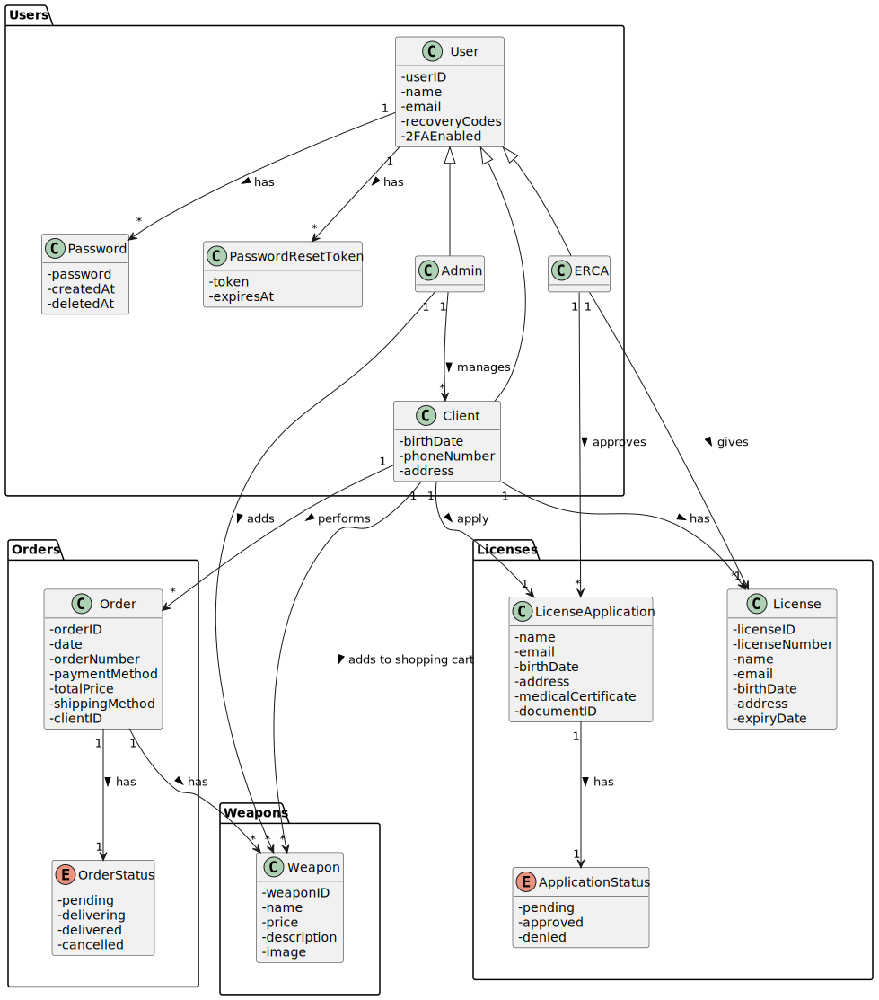
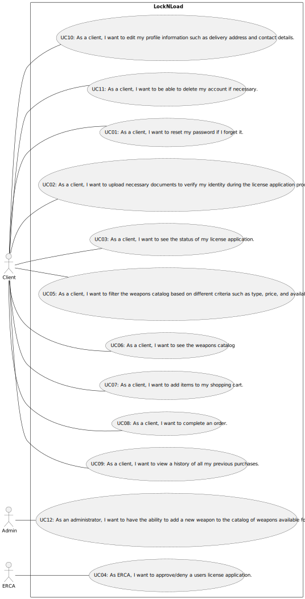
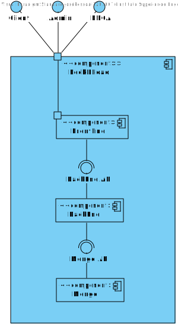
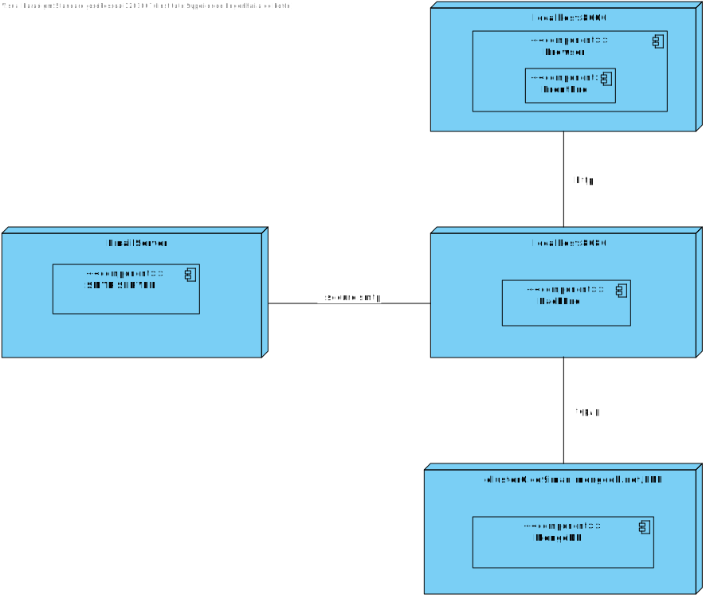

# Project Design

## Domain Model

## Use Case Diagram

## Views

### LEVEL 2

#### Logical View

#### Physical View

### LEVEL 3

#### Logical View BackEnd

#### Implementation View BackEnd

#### Logical View + Implementation View FrontEnd
