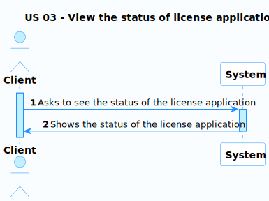
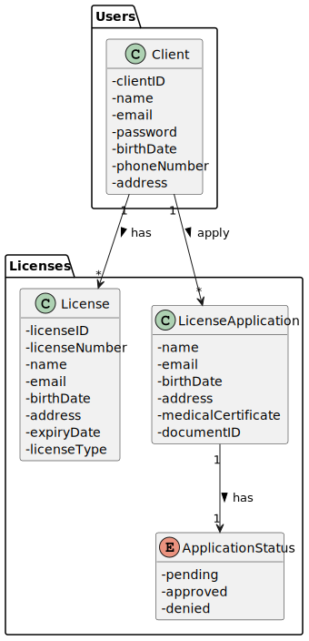
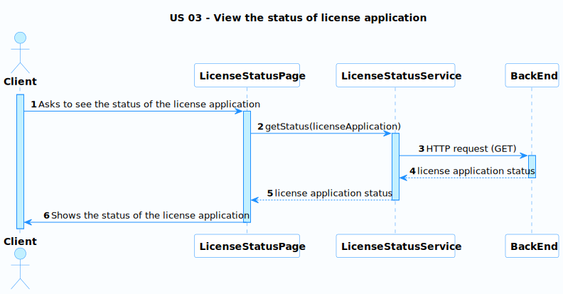
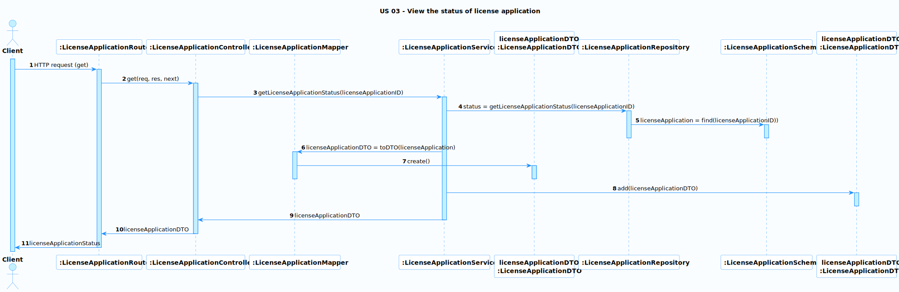

# US 03 - View the status of license application

### User Story Description

As a client, I want to see the status of my license application.

### Acceptance Criteria

### Found out Dependencies

* There is a dependency to US02 because to view the status the client must already have applied for a license.

### Input and Output Data

**Input Data:**

* N/A

**Output Data:**

* The license application status

### Entry and Exit Points and Assets

**Entry Points:**

* Dashboard Page

**Exit Points:**

* The license application status

**Assets**

| ID |      Name      |             Description              | Trust Level |
|----|:--------------:|:------------------------------------:|:-----------:|
| 1  | License Status | The status of the user's application | Client (3)  |

### System Sequence Diagram (SSD)

### Relevant Domain Model Excerpt 

## Sequence Diagram (SD) FrontEnd

## Sequence Diagram (SD) BackEnd

**Security Test Cases for US 03 (View the status of license application):**

1. **Authentication and Authorization:**
    - Ensure that the client can only view the status of their own application.
1. **Data Integrity:**
    - Test if the information shown to the client is correct.
1. **Error Handling:**
    - Induce errors during the status check process (e.g., a client without an application, request to see the status) and ensure that error messages are informative but do not reveal sensitive system details.
1. **Logging and Auditing:**
    - Confirm that the system logs all actions related to license process, including the client information, timestamp, and relevant message. This can be helpful for tracking and auditing purposes.

