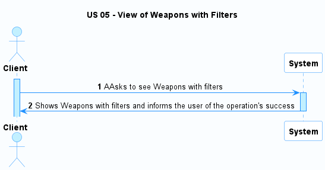
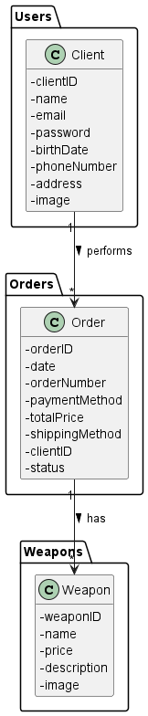
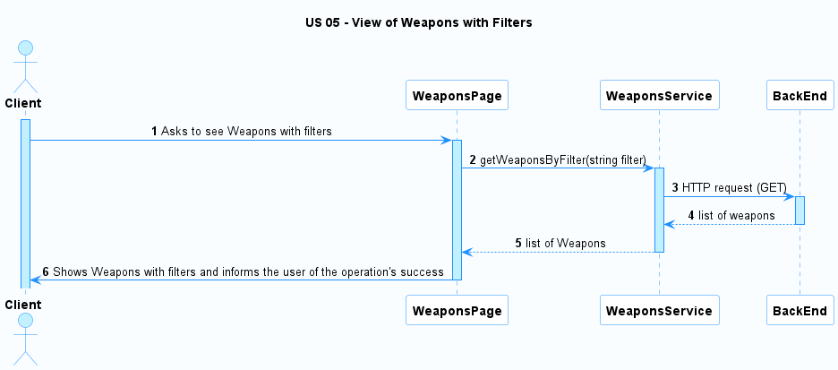
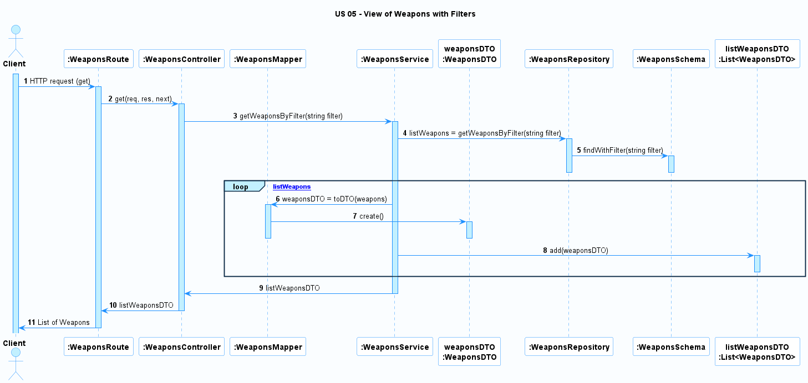

# US 05 - View of Weapons with Filters

### User Story Description

As a client,  I want to filter the weapons catalog based on different criteria such as type, price, and availability.

### Acceptance Criteria

* **AC1:** The client must have the ability to view weapons details.
* **AC2:** The client must have the ability to clear all applied filters to view the complete weapons catalog.

### Found out Dependencies

* There is a dependency to US12 because the weapons must have been created to be shown.

### Input and Output Data

**Input Data:**

* Filter information

**Output Data:**

* Weapons List

### Entry and Exit Points and Assets 

**Entry Points:**

* Input filter information

**Exit Points:**

* Weapons information

**Assets**

| ID |        Name         |                   Description                    | Trust Level |
|----|:-------------------:|:------------------------------------------------:|:-----------:|
| 1  | Weapons Information | The information about the details of the weapons |     all     |

### System Sequence Diagram (SSD)

### Relevant Domain Model Excerpt 

## Sequence Diagram (SD) FrontEnd

## Sequence Diagram (SD) BackEnd

