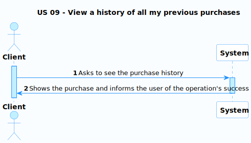
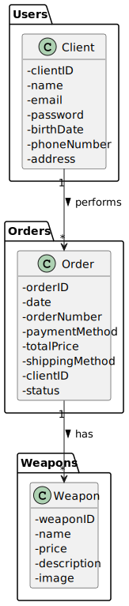
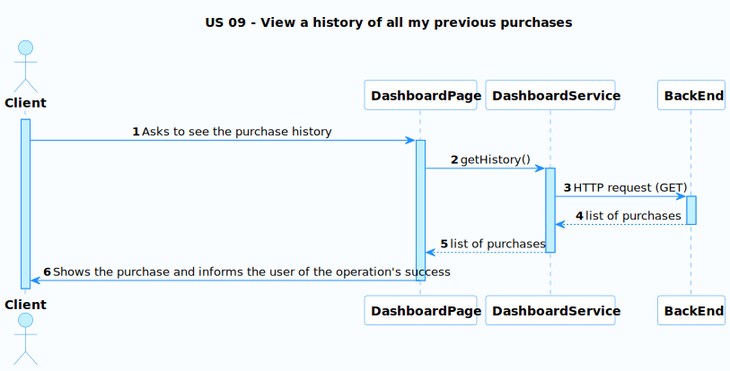
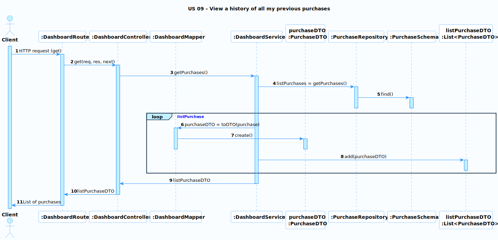

# US 09 - View a history of all my previous purchases

### User Story Description

As a client, I want to view a history of all my previous purchases.

### Acceptance Criteria

* **AC1:** The orders should appear from most recent to oldest.
* **AC2:** The client must have the ability to view all order details.

### Found out Dependencies

* There is a dependency to US08 because an order must have been made for a history to exist.

### Input and Output Data

**Input Data:**

* N/A

**Output Data:**

* Purchase history

### Entry and Exit Points and Assets

**Entry Points:**

* Dashboard page

**Exit Points:**

* Purchase history

**Assets**

| ID |        Name        |           Description            | Trust Level |
|----|:------------------:|:--------------------------------:|:-----------:|
| 1  | Client Information | The purchase history of the user | Client (3)  |

### System Sequence Diagram (SSD)

### Relevant Domain Model Excerpt 

## Sequence Diagram (SD) FrontEnd

## Sequence Diagram (SD) BackEnd

## Security Test Cases

**1. Authentication and Authorization**
- Ensure only authenticated clients can view their purchase history.

**2. Data Integrity**
- Verify that the purchase history data displayed matches the stored data.

**3. Error Handling**
- Error messages should be informative yet generic, without revealing any system details or sensitive information.

**4. Logging and Auditing**
- Confirm that the system logs all access and actions related to viewing purchase history.

