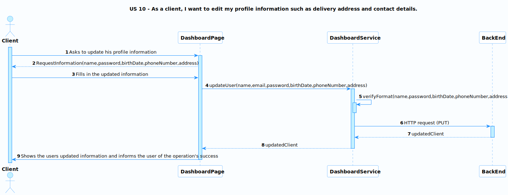
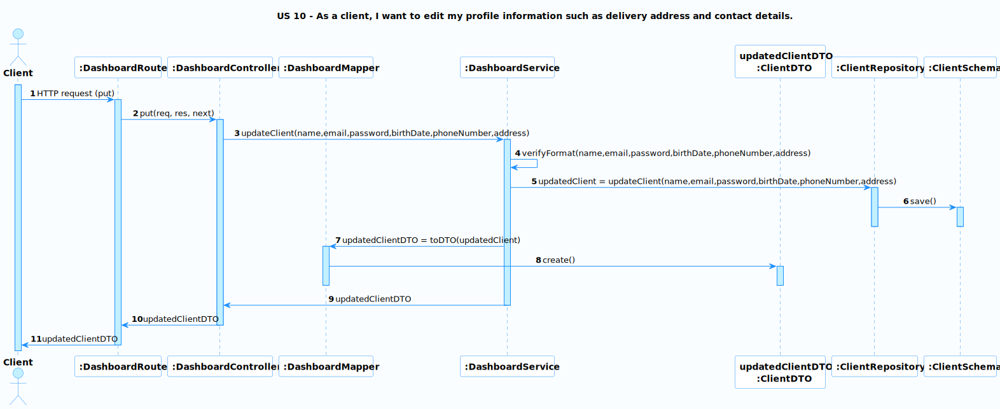

# US 10 - Edit my profile information

### User Story Description

As a client, I want to edit my profile information such as delivery address and contact details.
### Acceptance Criteria

* **AC1:** The client can change all information except for the email.
* **AC2:** The sensitive information such as passwords cannot be edited without appropriate authentication measures in place.

### Found out Dependencies

* This US does not depend on any other.

### Input and Output Data

**Input Data:**

* Information to be updated

**Output Data:**

* Updated Information

### Entry and Exit Points and Assets

**Entry Points:**

* Dashboard page

**Exit Points:**

* Updated Information

**Assets**

| ID |        Name        |        Description        | Trust Level |
|----|:------------------:|:-------------------------:|:-----------:|
| 1  | Client Information | The user's personal data  | Client (3)  |

### System Sequence Diagram (SSD)

### Relevant Domain Model Excerpt 

## Sequence Diagram (SD) FrontEnd

## Sequence Diagram (SD) BackEnd

## Security Test Cases

**1. Authentication and Authorization**
- Ensure only authenticated and authorized clients can edit their profile information.

**2. Input Validation and Sanitization**
- Ensure all input fields for editing profile information are protected against injection attacks.

**3. Data Integrity**
- Verify that the profile information saved matches the input provided by the client.

**4. Error Handling**
- Error messages should be informative yet generic, without revealing any system details or sensitive information.

**5. Logging and Auditing**
- Confirm that the system logs all actions related to editing profile information.

