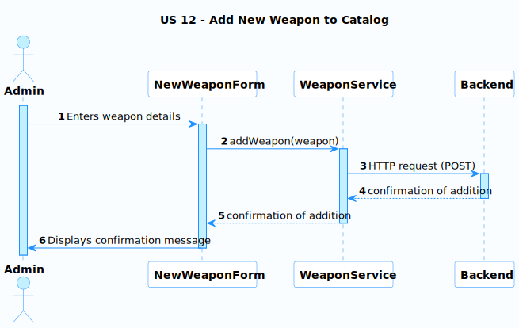

# US 12 - Add new weapon to catalog

### User Story Description

As an administrator, I want to have the ability to add a new weapon to the catalog of weapons available for sale.

### Acceptance Criteria

* **AC1:** As an administrator, I want to be able to enter the details of the new weapon, such as its name, price, description, and image.
* **AC2:** As an administrator, I want the system to validate the input data and notify me of any errors or missing information.
* **AC3:** As an administrator, I want the system to save the new weapon to the catalog and make it available for sale to clients.

### Found out Dependencies

- None

### Input and Output Data

**Input Data:**

- Weapon name
- Weapon price
- Weapon description
- Weapon image

**Output Data:**

- Confirmation message that the new weapon has been added to the catalog

### Entry and Exit Points and Assets

**Entry Points:**

- Administrator logs in to the system
- Administrator navigates to the "Add New Weapon" page

**Exit Points:**

- Administrator receives confirmation message that the new weapon has been added to the catalog

**Assets**

| ID   | Name                | Description                                                  | Trust Level |
| ---- | ------------------- | ------------------------------------------------------------ | ----------- |
| 1    | Weapon Catalog      | The catalog of weapons available for sale                    | High        |
| 2    | Add New Weapon Form | The form used by the administrator to enter the details of the new weapon | Medium      |

### System Sequence Diagram (SSD)

**This SSD shows the interactions between the Administrator and the System** to add a new weapon to the catalog. The Administrator enters the weapon details, which are then validated by the System. Once the weapon details are confirmed, the System displays a confirmation message to the Administrator.

### Relevant Domain Model Excerpt 

This shows that an **Admin** can add one or many **Weapons** to the system. The **Weapon** class has attributes for `weaponID`, `name`, `price`, `description`, and `image`. The **Admin** class has attributes for `adminID`, `name`, `email`, and `password`. The association between **Admin** and **Weapon** is represented by the "`adds`" relationship, with the multiplicity of "`*`" on the **Weapon** side, indicating that an **Admin** can add many **Weapons**.

## Sequence Diagram (SD) FrontEnd

**This sequence diagram shows the interactions between the Admin, NewWeaponForm, WeaponService, and Backend components**. The Admin enters the weapon details in the `NewWeaponForm`, which then calls the `addWeapon()` method of the `WeaponService`. The `WeaponService` sends an HTTP POST request to the `Backend` to add the new weapon to the catalog. The `Backend` responds with a confirmation of addition, which is passed back to the `NewWeaponForm` to display a confirmation message to the Admin.

## Sequence Diagram (SD) BackEnd

**The Sequence Diagram (SD) for US 12** describes the interactions between the **Admin** and the system to add a new weapon to the catalog. The **Admin** initiates a HTTP POST request to the `WeaponResource`, which in turn invokes the `addWeapon()` method in the `WeaponController`. The `WeaponController` then delegates the creation of the weapon to the `WeaponService` by calling the `createWeapon()` method and passing in the `weaponDTO`, which contains the details of the new weapon.

The `WeaponService` then saves the weapon by calling the `saveWeapon()` method in the `WeaponRepository`, which creates a new `Weapon` object based on the `weaponDTO` and saves it to the database using the `WeaponSchema`. Once the weapon is saved, the `WeaponRepository` returns the new weapon object to the `WeaponService`, which then returns it to the `WeaponController`. The `WeaponController` then returns the new weapon object to the `WeaponResource`, which responds to the **Admin** with a "New Weapon Added" message.

Overall, the SD illustrates how the **Admin** interacts with the system to add a new weapon to the catalog, and how the system components interact with each other to process the request and persist the data.

**Security Test Cases for US 12 (Add New Weapon to Catalog):**

1. **Authentication and Authorization:**
   - Ensure that only administrators can access and use the "Add New Weapon" page.
   - Test that regular clients or unauthorized users cannot add new weapons to the catalog.
1. **Input Validation and Sanitization:**
   - Thoroughly test all input fields with various types of input, including invalid data, special characters, SQL injection attempts, and XSS payloads.
   - Verify that input is properly sanitized before being stored in the database or displayed on the website.
1. **File Upload Security:**
   - If allowing image uploads, test for vulnerabilities related to file type restrictions, file size limits, and potential malicious file uploads (e.g., executable files disguised as images).
   - Ensure that uploaded images are stored securely and cannot be used to execute arbitrary code on the server.
1. **Data Integrity:**
   - Test that the saved weapon data matches the input provided by the administrator.
   - Verify that the system prevents duplicate weapon entries with the same name or other unique identifiers.
1. **Error Handling:**
   - Induce errors during the weapon addition process (e.g., by submitting incomplete forms or invalid data) and ensure that error messages are informative but do not reveal sensitive system details.
1. **Logging and Auditing:**
   - Confirm that the system logs all actions related to adding new weapons, including the administrator's ID, timestamp, and changes made. This can be helpful for tracking and auditing purposes.
