# Security

[TOC]

## Threat Modeling

### External Dependencies

| Id    | Description                                                                                                                                                                                                                                                                                                                                                                        | 
|-------|:-----------------------------------------------------------------------------------------------------------------------------------------------------------------------------------------------------------------------------------------------------------------------------------------------------------------------------------------------------------------------------------|
| 1     | The system will utilize a MongoDB instance in the cloud for the database. This instance will be configured in accordance with LockNLoad's security standards, including the implementation of security policies recommended by the cloud service provider.                                                                                                                         |
| 2     | The application will be deployed on a local server. This server will be configured in accordance with LockNLoad's security standards, including the installation of the latest security updates for both the operating system and the application.                                                                                                                                 |
| 3     | The application development will utilize libraries and frameworks as determined by the specific project needs. Choices will be made based on best development practices and required functionalities, ensuring the system's efficiency, security, and scalability. The selected libraries and frameworks will be installed and kept updated throughout the project's lifecycle.    |

### Entry Points
| Name	        | Description                                                                                                                        | 
|--------------|:-----------------------------------------------------------------------------------------------------------------------------------|
| HTTPS Port   | The LockNLoad website will be only be accessible via TLS. All pages within the LockNLoad website are layered on this entry point.  |
| Input fields | Allow users to input text freely, such as names, addresses, etc.                                                                   |
| Upload files | Allow users to select files from their local device to send to the server. This can be used for uploading documents.               |

### Exit Points

| Name	                | Description                                                                                                                                                                                                                 | 
|----------------------|:----------------------------------------------------------------------------------------------------------------------------------------------------------------------------------------------------------------------------|
| Success Notification | Notifications informing users that an operation has been successfully completed. They typically include relevant information about the successful operation and can be displayed in a prominent area of the user interface. |
| Failure Notification | Notifications alerting users about failures or errors during an operation. These messages typically provide details about the encountered issue and may include instructions on how to resolve the problem, if possible.    |
| Response Data        | Responses should be structured in a clear and organized manner, following a consistent format to facilitate understanding and processing by users and systems.                                                              |

### Trust Levels

| ID | Name	           | Description                                                                                                                               | 
|----|-----------------|:------------------------------------------------------------------------------------------------------------------------------------------|
| 1  | Store Admin     | The authenticated user who controls the store's operations manages the catalog and communicates with customers.                           |
| 2  | ERCA            | The authenticated user responsible for managing licenses, meaning it reviews requests to approve or reject the allocation of the license. |
| 3  | Client          | The authenticated user capable of submit a license application or making orders.                                                          |
| 4  | Anonymous user  | Unauthenticated user with access to the catalog.                                                                                          |
| 5  | System Admin    | User responsible for overseeing and maintaining all system components in operation.                                                       |

### Sensitive Data

Data will be classified as :
- Public: Information intended for public consumption.
- Internal Use Only: Information meant for internal company use only.
- Confidential: Sensitive information that requires protection.
- Highly Confidential: Extremely sensitive information requiring the highest level of protection.

| Data element	               | Description         | 
|-----------------------------|:--------------------|
| License information         | Highly Confidential |
| Client personal information | Highly Confidential |
| Client address              | Internal Use Only   |
| Admin personal information  | Highly Confidential |
| ERCA personal information   | Highly Confidential |
| Weapon information          | Public              |
| Order information           | Confidential        |

## Secure File Transfer

The files will be served as octet stream download, so the file is transmitted as a series of bytes without any interpretation by the browser. This allows any type of file, whether it be a document, image, video, or executable, to be downloaded by the client device instead of being displayed directly in the browser.

### Data Flow Diagram

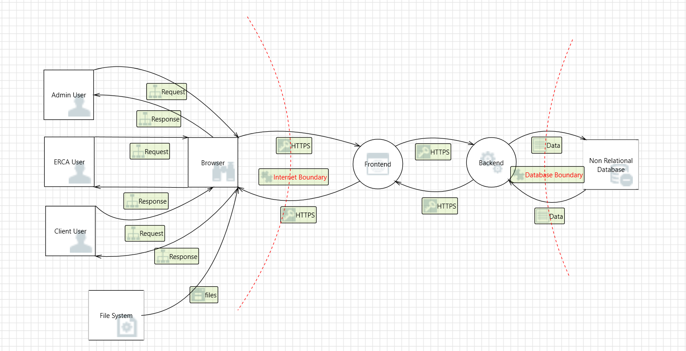
## Threats

Security threats come in different forms, including conventional malware assaults and more sophisticated approaches like social engineering and brute force attacks. Malicious individuals might focus on operating systems, applications, network equipment, taking advantage of vulnerabilities that are already known or recently uncovered in order to illegally access or harm.
Moreover, software security risks are always changing as attackers create new methods to get around current security measures. The complexity of these threats is growing, requiring a proactive and diverse strategy to safeguard systems and data from unauthorized access.
It is important for organizations and individuals who depend on technology to grasp the various types of software security threats, the tactics employed by attackers, and effective strategies for reducing these risks.

To effectively combat these threats, it is crucial to identify and analyze them comprehensively. For that matter, the framework STRIDE will be used, which categorizes threats into different types based on their characteristics. By assessing these threats and assigning them impact and probability scores, the team can prioritize their security efforts and allocate resources effectively to mitigate potential risks.

Threats are ranked based on a scale calculated by multiplying their impact and probability scores, each ranging from 1 to 5. Consequently, the highest possible rank a threat can receive is 25.

## Spoofing

Spoofing is a technique in which someone falsifies information to deceive systems, networks, or individuals, typically with the aim of gaining unauthorized access to sensitive data. There are various types of spoofing, but the most concerning for our system is IP Spoofing.

IP Spoofing consists in an attacker masking or falsifying the source IP address of a data packet to make it appear as though it is coming from a trusted source when it is not. This can be used for various malicious purposes, such as bypassing authentication and launching Denial of Service (DDoS) attacks.

This vulnerability belong to the letter S in STRIDE corresponding to Spoofing.

### Rank

Impact 5: High Impact
The system deals with sensitive information such as user authentication credentials, personal details, and license application documents. A successful spoofing attack could lead to unauthorized access to user accounts, compromising their personal data and potentially allowing unauthorized purchases or modifications to their account details.

Probability 4: Moderate to Severe
While the system aims to implement security measures, including authentication mechanisms, the probability of a spoofing attack cannot be disregarded. Attackers may exploit vulnerabilities in the authentication process, such as weak password policies or insufficient validation of user identities, to carry out spoofing attacks.

The rank of this threat is very high (5x4 = 20).

### Countermeasures and mitigation

- Strict filtering at ingress and egress points
- Implement Network Address Translation (NAT)
- Implement Strong Access Controls
- Regular Security Audits and Updates

## Tampering

It refers to the possibility of an attacker modifying data unauthorized. This may include altering information in transit, manipulating data stored in databases or files, or even tampering with executable code.

This vulnerability belong to the letter T in STRIDE corresponding to Tampering.

### Rank

Impact 4: Moderate to Severe
The vulnerability to tampering in this system can lead to serious consequences, including compromise of data integrity, potential for fraudulent transactions, loss of user trust in the system, and damage to the platform's reputation. This can result in significant financial, legal, and reputational consequences.

Probability 3: Possible
There is always the possibility that malicious users may attempt to manipulate legitimate transactions or data changes. The probability is considered moderate, as the risk is inherent in any transaction and data management system.

The rank of this threat is medium (4x3 = 12).

### Countermeasures and mitigation

- Data Input Validation
- Data Encryption

## Repudiation

It refers to the ability to deny that a specific action occurred or was performed. It implies that an entity involved in a transaction can later deny having carried out that transaction.

This vulnerability belong to the letter R in STRIDE corresponding to Repudiation.

### Rank

Impact 4: Moderate to Severe
The repudiation of operations can lead to legal disputes, loss of user trust in the system, and damage to the platform's reputation. This can result in significant financial, legal, and reputational consequences.

Probability 3: Possible
There is always the possibility that malicious users may attempt to repudiate legitimate transactions or data changes. The probability is considered moderate, as the risk is inherent in any transactional and data management system.

The rank of this threat is medium (4x3 = 12).

### Countermeasures and mitigation

- Activity logs
- Email or SMS Confirmations

## Information disclosure

The information disclosure vulnerability refers to the unauthorized exposure of sensitive data to unauthorized users. This can occur in various ways, such as unauthorized access to confidential information, leakage of personal or financial data, or exposure of technical details about the internal workings of the system.

In the context of a system for the sale of firearms and licenses, information disclosure can be especially concerning due to the sensitive nature of the data handled by the system. This could include the exposure of customers' personal information, firearm purchase history, licensing records, and details of financial transactions.

This vulnerability belong to the letter I in STRIDE corresponding to Information disclosure.

### Rank

Impact 5: High Impact.The impact of this vulnerability can be severe, potentially resulting in unauthorized access to sensitive user data, such as personal information and transaction histories. Additionally, exploitation of this vulnerability may lead to  reputational damage, financial loss, and legal repercussions for the organization.

Probability 4 : Moderate to Severe. There is always the possibility that malicious users may attempt to gain access to critical information to harm others . The probability is considered severe, as the risk is inherent in any system.

The rank of this threat is High (5x4 = 20).

### Countermeasures and mitigation

- Implement Strong Password Policies and Two-Factor Authentication
- Block login after n failed attempts
- Implement Data Encryption

## Denial of Service

The Denial of Service (DoS) vulnerability refers to the potential for attackers to disrupt or degrade the availability of a system, rendering it inaccessible or unusable for legitimate users.
In the context of a system for the sale of firearms and licenses, a DoS attack could manifest as an attempt to overwhelm the system's resources, such as its web servers or network infrastructure, with a high volume of malicious traffic. 
This could lead to service interruptions, downtime, and loss of access for users attempting to purchase firearms or obtain licenses through the system.

This vulnerability belong to the letter D in STRIDE corresponding to Denial of Service.

### Rank

Impact 3:Moderate.The impact of this vulnerability can be significant, potentially resulting in denial of service (DoS) conditions where users are unable to access the system or experience considerable delays in performing tasks.
This can lead to frustration among users, loss of productivity, and reputational damage for the organization.

Probability 4: While the system aims to implement security measures the probability of a DDOS attack cannot be disregarded. Attackers may exploit the vulnerabilities in the system to flood the system with an overwhelming volume of traffic, causing service disruption or downtime

The rank of this threat is medium (3x4 = 12).

### Countermeasures and mitigation

- Implement failover mechanisms and redundancy
- Implement application-level defenses to detect and mitigate DoS attacks
- Use of DDoS Mitigation Services

## Elevation of privilege

The Elevation of Privilege vulnerability refers to the risk of unauthorized users gaining elevated access rights or privileges within a system, allowing them to perform actions or access resources beyond their intended level of authorization. 
In the context of a system for the sale of firearms and licenses, an Elevation of Privilege vulnerability could manifest as an attacker exploiting weaknesses in the authentication or authorization mechanisms to escalate their privileges and gain unauthorized access to sensitive data or administrative functionalities.

This vulnerability belong to the letter E in STRIDE corresponding to Elevation of privilege.

### Rank

Impact 5: High Impact. Unauthorized elevation of privileges could result in compromising the integrity of user data, unauthorized access to administrative functionalities, and potential regulatory violations.

Probability 3: Moderate. The risk of attackers exploiting vulnerabilities to elevate their privileges is a realistic concern, especially given the sensitive nature of the information handled by the system. This makes it particularly attractive to malicious individuals who may seek to gain unauthorized access to personal information.

The rank of this threat is moderate to Severe (5x3 = 15).

### Countermeasures and mitigation

- Implement Strong Password Policies 
- Implement Two-Factor Authentication
- Limit the amount of permission given to users to the bare minimum required for their roles

## Abuse Case Diagrams

In the quest for more secure and reliable software systems, it's essential to understand and anticipate potential abuses or misuse. With the goal of identifying vulnerabilities and protecting the system against potential threats, some abuse case diagrams of the system will be presented.

### Man-in-the-middle

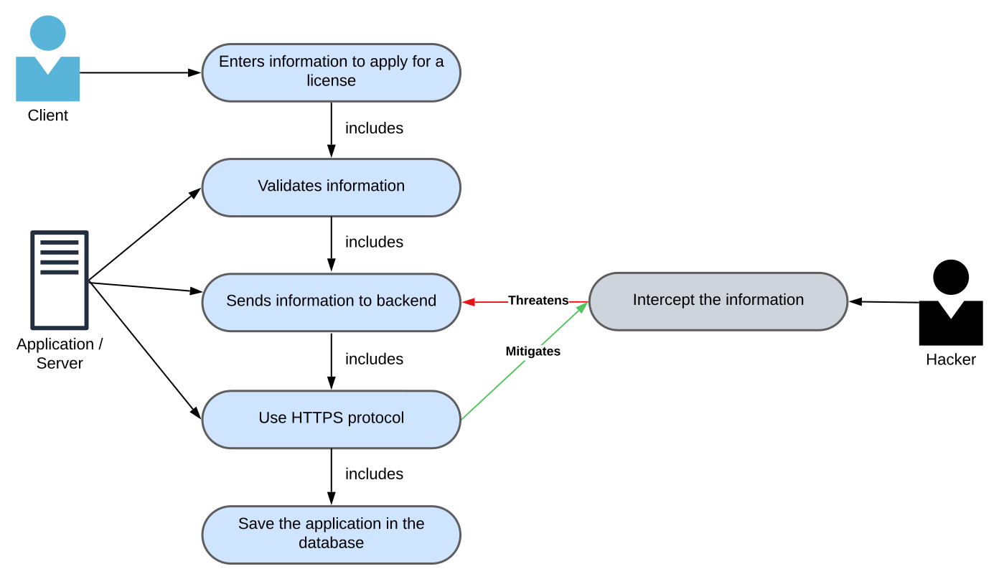

### Repudiation

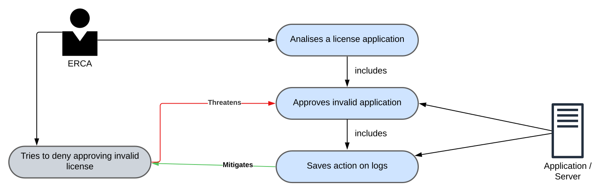

#### Validation

All actions store logs in a database different from the one used by the application. For testing purposes, a license was approved and, as shown in the following image, a log was saved with the ERCA that approved it.

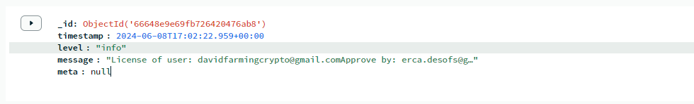

### Login

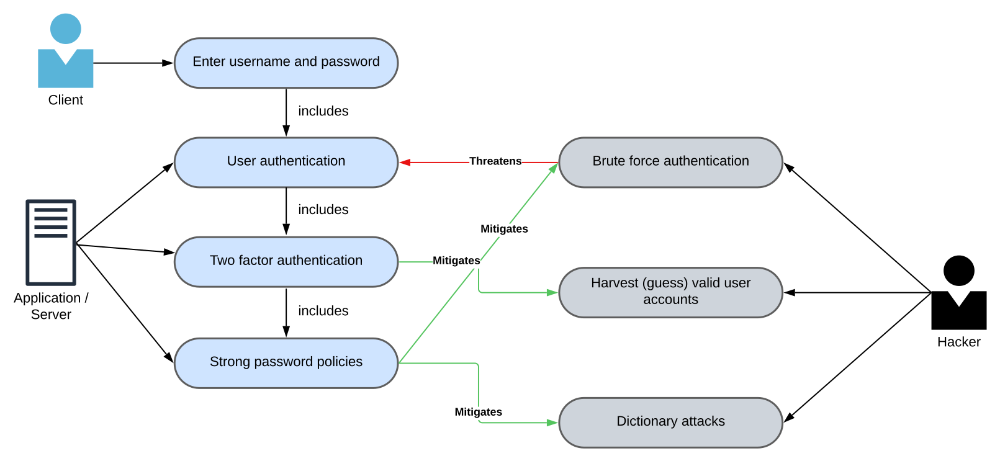

#### Validation

To verify if this requirement is correctly implemented, the application was tested. And as can be seen in the following images, the objectives were achieved.

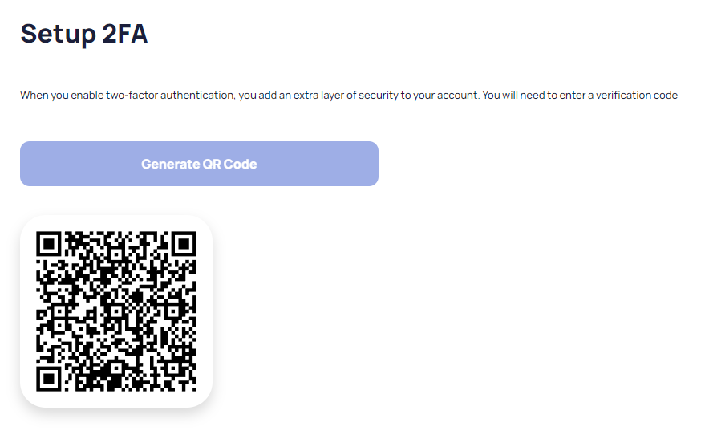

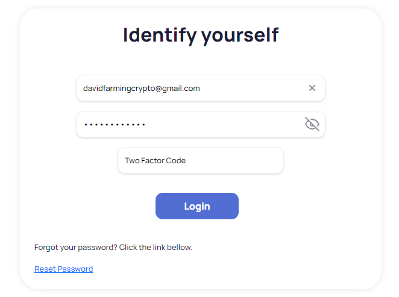

### Injection Attacks

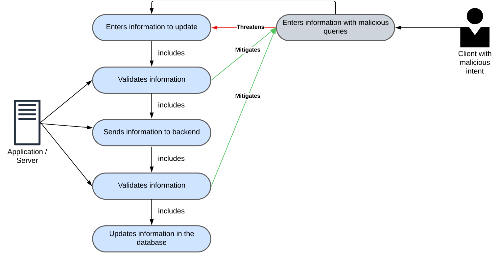

#### Validation

The system inputs are checked through a mechanism against malicious query injection.

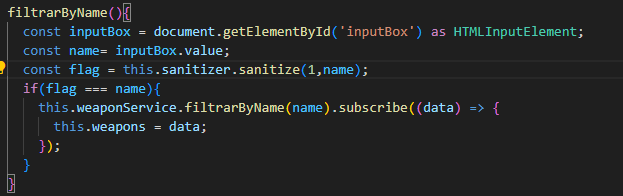

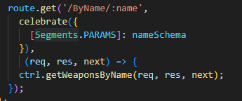

### Spoofing

For the user to recover their password, they receive an email with the steps they need to follow to change their password.

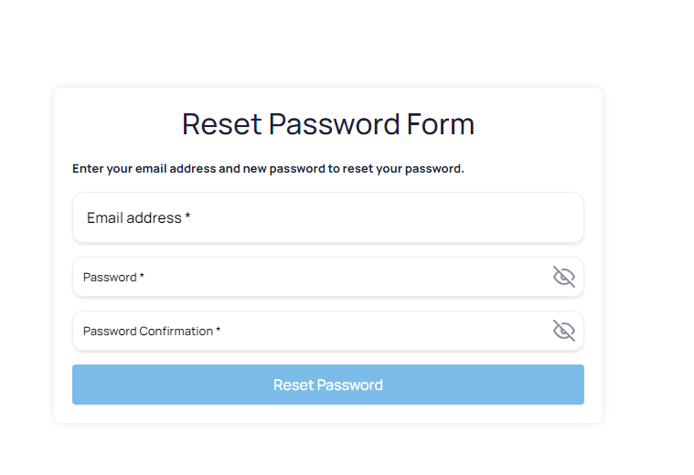

#### Validation

### Spoofing

#### Validation

To check the status, the user receives a link via email. This email contains a token that is used to identify the user when they want to check the status of their request.

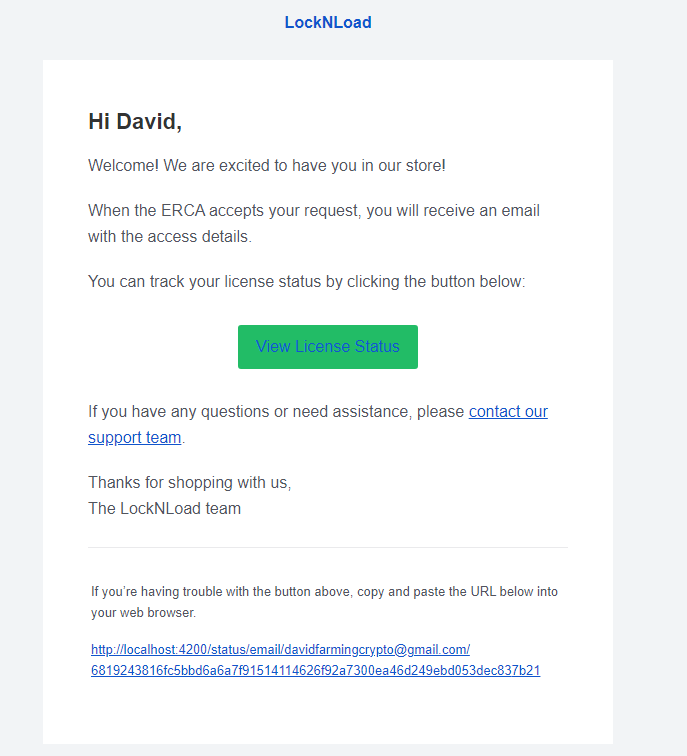

### Injection Attacks

#### Validation

The system inputs are checked through a mechanism against malicious query injection.

## Security controls

In order to centralize and manage the security controls, the following table will be used to list the security controls 
that will be implemented in the system. This will help to ensure that the system is secure and that the security 
controls are properly implemented and maintained in a reliable and reusable way.

| Security Control         | Component            | Description                                                  |
| ------------------------ | -------------------- | ------------------------------------------------------------ |
| Midleware                | Backend and Frontend | To better handling the user allowed routes a middleware mechanism will be implemented in the both components. Since both application (Front End and Backend) have a routing system all the routes should be assigned to one or more middlewares to check if the authenticated user/unauthenticated user can access the resourse. Identified middlewares: GuestMiddleware, ClientMiddleware, AdminMiddleware and ErcaMiddleware. |
| Authorization Policies   | Backend              | To reuse authorization checks bettwen diffrent resources a authorization mecanism can be created to check if a determined user can in fact create/edit a specific resource. For example, a user can only edit his own password, so when we are creating a new password the PasswordPolicy should ensure that the editing password belongs to the authenticated user. |
| Error message mecanism   | Backend and Frontend | Buil a error message class in both components to define tha way that the messages should be returned, this mitigates the leak of error cointaining critical data but being verbose enough to let the end user know what is wrong. |
| Axios/Ajax request class | Front end            | Develop a class that must be used in all the requests maded by the front end application, this ensures exception handles, redirects and success messages to being always prossed in the same steps. Additionaly ensures that the authentication user token is used in every request with the backend application. |

## Secure Database Access

To ensure a high level of security in the system database there are some security measures that should be taken
into account. The following list contain some of the security measures that will be implemented to secure the database 
access.

1. Secure Queries: Use parameterized queries to attacks like SQL Injection.
2. Secure Configuration: Ensure that the database is properly configured and that access is restricted to authorized 
users.
3. Secure Authentication: Use strong authentication mechanisms to ensure that only authorized users can access the
database and change the default passwords.
4. Secure Communication: Use encryption to protect data in transit between the application and the database.

The team will follow these security measures to ensure that the database is secure and that data is protected from
unauthorized access, for more information about this topic the following link can be accessed 
[C3: Secure Database Access](https://owasp.org/www-project-proactive-controls/v3/en/c3-secure-database)

## Secure Email Services

To ensure that the email services used by the system are secure, the following security measures will be implemented:

1. Secure Configuration: Ensure that the email server is properly configured and that access is restricted to 
authorized users.
2. Secure Authentication: Use strong authentication mechanisms to ensure that only authorized users can access the
email server and change the default passwords.
3. Secure Communication: Use encryption to protect data in transit between the application and the email server.

## Access Control Mechanism

The application will implement a **single** and well-vetted access control mechanism to manage access to protected data and resources. This mechanism will ensure that all requests pass through a **centralized access control system**, avoiding insecure alternative paths or copy-and-paste methods.

The chosen access control mechanism is based on the **Role-Based Access Control (RBAC)** model, which grants access to resources based on the roles assigned to users. The following roles have been defined:

1. **Store Admin**: Manages the store's operations, catalog, and customer communications.
1. **ERCA**: Responsible for managing licenses and approving or rejecting license allocations.
1. **Client**: Can submit license applications and make orders.
1. **Anonymous User**: Has access to the catalog but cannot perform any actions that require authentication.
1. **System Admin**: Oversees and maintains all system components in operation.

The access control mechanism will be implemented using **middleware** in both the backend and frontend applications. Middleware functions will be assigned to each route to verify if an authenticated or unauthenticated user can access a specific resource. The identified middlewares are:

1. `GuestMiddleware`: For unauthenticated users.
1. `ClientMiddleware`: For authenticated clients.
1. `AdminMiddleware`: For authenticated store admins.
1. `ErcaMiddleware`: For authenticated ERCA users.

By implementing this access control mechanism, the application will ensure that all requests pass through a centralized system, reducing the risk of unauthorized access and maintaining the security of protected data and resources.

## Server-side Access Control Enforcement

To ensure the security of protected data and resources, LockNLoad enforces access controls at trusted enforcement points such as access control gateways, servers, and serverless functions. Access control is never enforced on the client-side, as it can be bypassed or tampered with by malicious users.

The application employs the following server-side access control mechanisms:

1. **Access Control Gateways**: Access control gateways are configured to enforce access control policies based on user roles and permissions. These gateways act as a first line of defense, ensuring that only authorized requests are forwarded to the backend services.
1. **Server-side Access Control Checks**: The backend services perform access control checks before processing any request. These checks verify that the user has the appropriate role and permissions to access the requested resource. This is achieved using middleware functions that are assigned to each route, as described in the [Access Control Mechanism](#access-control-mechanism) section.
1. **Serverless Functions**: Serverless functions are configured to enforce access control policies as well. When a serverless function is invoked, it verifies the user's role and permissions before executing the requested operation.

By enforcing access controls at trusted enforcement points on the server-side, LockNLoad ensures that access to protected data and resources is secure and cannot be easily bypassed by malicious users.

## Attribute or Feature-based Access Control

**LockNLoad** employs attribute or feature-based access control to ensure that users have the appropriate authorizations for specific features or data items. This approach provides more granular access control compared to **role-based access control** alone. While roles are still used to allocate permissions, attribute or feature-based access control allows for more fine-grained access control checks.

The application implements attribute or feature-based access control using the following approach:

1. **Define Attributes or Features**: Identify the specific attributes or features that require fine-grained access control. These could be specific data items, actions, or resources within the application.
   - `Reset password (US 01)`
   - `Upload identity documents (US 02)`
   - `View license application status (US 03)`
   - `Approve/deny license application (US 04)`
   - `Filter weapons catalog (US 05)`
   - `View weapons catalog (US 06)`
   - `Add items to shopping cart (US 07)`
   - `Complete an order (US 08)`
   - `View purchase history (US 09)`
   - `Edit profile information (US 10)`
   - `Delete account (US 11)`
   - `Add new weapon to the catalog (US 12)`
1. **Assign Authorizations**: For each user role, assign authorizations that specify which attributes or features they can access. These authorizations can be stored in the user's profile or in a separate access control list.
   - **Client**: Reset password, upload identity documents, view license application status, filter weapons catalog, view weapons catalog, add items to shopping cart, complete an order, view purchase history, edit profile information, delete account
   - **ERCA**: Approve/deny license application
   - **Administrator**: Add new weapon to the catalog
1. **Access Control Checks**: Before granting access to a specific attribute or feature, the application performs an access control check to verify that the user has the required authorization. This check is performed in addition to the role-based access control checks.
   1. Before a client can reset their password, verify that the user is authenticated and has the required authorization for password reset.
   1. Before a client can upload identity documents, verify that the user is authenticated and has the required authorization for document upload.
   1. Before a client can view their license application status, verify that the user is authenticated and has the required authorization for viewing application status.
   1. Before an ERCA user can approve/deny a license application, verify that the user is authenticated, has the ERCA role, and has the required authorization for approving/denying applications.
   1. Before a client can filter the weapons catalog, verify that the user is authenticated and has the required authorization for catalog filtering.
   1. Before a client can view the weapons catalog, verify that the user is authenticated and has the required authorization for viewing the catalog.
   1. Before a client can add items to their shopping cart, verify that the user is authenticated and has the required authorization for adding items to the cart.
   1. Before a client can complete an order, verify that the user is authenticated and has the required authorization for completing orders.
   1. Before a client can view their purchase history, verify that the user is authenticated and has the required authorization for viewing purchase history.
   1. Before a client can edit their profile information, verify that the user is authenticated and has the required authorization for editing profile information.
   1. Before a client can delete their account, verify that the user is authenticated and has the required authorization for account deletion.
   1. Before an administrator can add a new weapon to the catalog, verify that the user is authenticated, has the administrator role, and has the required authorization for adding new weapons.

By implementing attribute or feature-based access control, **LockNLoad** ensures that users only have access to the specific features or data items they are authorized to access, providing an additional layer of security.

## Input and Output Requirements

**LockNLoad** ensures that input and output requirements are clearly defined and that data is handled and processed based on type, content, and applicable laws, regulations, and other policy compliance.

### Data Classification

Data is classified into the following categories:

1. **Public**: Information intended for public consumption.
1. **Internal Use Only**: Information meant for internal company use only.
1. **Confidential**: Sensitive information that requires protection.
1. **Highly Confidential**: Extremely sensitive information requiring the highest level of protection.

#### Examples

In the context of the **LockNLoad** project, here are specific examples of input and output classification:

1. **Public:**
   - **Input**: Weapon filter criteria provided by the client when browsing the catalog (US 05, US 06). This information does not contain sensitive data and can be publicly accessible.
   - **Output**: Weapons catalog information displayed to clients (US 05, US 06). This information is intended for public consumption and does not require any specific protection.
1. **Internal Use Only:**
   - **Input**: Client's feedback or support requests submitted through the application. This information is intended for internal use only to improve the platform or resolve client issues.
   - **Output**: Internal system notifications or alerts related to client activities, such as new license applications or order completions. These notifications are meant for internal use only and should not be shared with external parties.
1. **Confidential:**
   - **Input**: Client's personal information provided during registration or profile editing (US 10), such as their name, address, and contact details. This information is considered sensitive and should be protected.
   - **Output**: Client's order history (US 09) containing information about purchased items, transaction details, and delivery status. This information should be kept confidential and only accessible to the client and authorized support staff.
1. **Highly Confidential:**
   - **Input**: Client's identity documents uploaded during the license application process (US 02). These documents contain highly sensitive personal information and require the highest level of protection.
   - **Output**: License application status (US 03) containing information about whether a client's license application has been approved or denied. This information is highly confidential and should only be accessible to the client and ERCA staff responsible for managing licenses.

### Data Handling and Processing

For each data classification, LockNLoad adheres to specific data handling and processing guidelines:

1. **Public**: No specific handling or processing requirements are needed for public data.
1. **Internal Use Only**: Access to internal use only data is restricted to authorized users. Data should not be shared with external parties without proper authorization.
1. **Confidential**: Confidential data is encrypted both at rest and in transit. Access to confidential data is granted on a need-to-know basis. Audit logs are maintained to track access and modifications to confidential data.
1. **Highly Confidential**: Highly confidential data is encrypted using strong encryption algorithms both at rest and in transit. Access to highly confidential data is strictly limited to authorized personnel. Access attempts and modifications are logged and monitored for any suspicious activity.

### Compliance with Laws and Regulations

LockNLoad complies with all applicable laws and regulations related to data handling and processing, including but not limited to:

1. General Data Protection Regulation (GDPR)
1. Payment Card Industry Data Security Standard (PCI DSS)
1. Any other relevant local, state, or federal regulations

## Serialization and Deserialization Security

**LockNLoad** ensures that serialization is not used when communicating with untrusted clients to prevent deserialization attacks, including object injection. If serialization is required in certain cases, adequate integrity controls and encryption measures are enforced.

### Avoiding Serialization

To avoid using serialization when communicating with untrusted clients:

1. Use **JSON** or other text-based data formats for API requests and responses, as they are less susceptible to deserialization attacks compared to binary formats.
1. Implement custom data transfer objects (**DTOs**) for communication between the client and server, rather than serializing and deserializing domain objects directly.

### Integrity Controls and Encryption

In cases where serialization cannot be avoided, **LockNLoad** enforces the following integrity controls and encryption measures:

1. **Digital Signatures**: Digital signatures are used to verify the integrity and authenticity of serialized data. The server signs the data before sending it to the client, and the client verifies the signature before deserializing the data.
1. **Encryption**: If sensitive data is sent, it is encrypted using strong encryption algorithms both in transit and at rest. This ensures that even if an attacker intercepts the data, they cannot access the sensitive information.
1. **Input Validation**: Strict input validation is performed on all serialized data to ensure that it conforms to the expected format and does not contain any malicious content.

### Examples

1. **Avoiding Serialization**: When sending data related to the weapons catalog (**US 05, US 06**) or order history (**US 09**) from the server to the client, use **JSON** or other text-based data formats instead of binary formats. This helps avoid deserialization attacks, as text-based formats are less susceptible to object injection.
1. **Digital Signatures:** When sending sensitive data, such as license application status (**US 03**) or client personal information (**US 10**), from the server to the client, digitally sign the data to ensure its integrity and authenticity. The client can then verify the digital signature before processing the data.
   - Example: The server signs the license application status data before sending it to the client. The client verifies the signature using the server's public key and only processes the data if the signature is valid.
1. **Encryption:** When sending highly sensitive data, such as identity documents (**US 02**) or payment information, encrypt the data using strong encryption algorithms both in transit and at rest.
   - Example: When a client uploads their identity documents for the license application process, the documents are encrypted using **AES-256 encryption** before being sent to the server. The server then stores the encrypted documents securely.
1. **Input Validation:** Perform strict input validation on all serialized data received from untrusted clients to ensure it conforms to the expected format and does not contain any malicious content.
   - Example: When a client submits a new order (**US 08**), the server validates the order data to ensure it contains valid item IDs, quantities, and other relevant information. Any invalid or suspicious data is rejected, and the order is not processed.

## Input Validation on Trusted Service Layer

**LockNLoad** ensures that input validation is enforced on a trusted service layer to protect against malicious inputs and maintain data integrity.

### Server-side Input Validation

All input validation is performed on the server-side, as the server is considered a trusted service layer. Client-side input validation is used only for providing a better user experience and should not be relied upon for security purposes.

Examples of server-side input validation in the context of the user stories include:

1. **Password Reset (US 01)**: When a client requests a password reset, validate the new password to ensure it meets the minimum length, complexity, and uniqueness requirements.
1. **License Application (US 02, US 03, US 04)**: When a client submits their license application, validate the provided information, such as personal details and identity documents, to ensure they are valid and meet the necessary criteria.
1. **Weapons Catalog (US 05, US 06)**: When a client filters or searches the weapons catalog, validate the filter criteria and search terms to ensure they are safe and do not contain any malicious content.
1. **Order Processing (US 07, US 08)**: When a client submits an order, validate the order data, such as item IDs, quantities, and payment information, to ensure it is valid and consistent with the available inventory and pricing.
1. **Profile Editing (US 10)**: When a client edits their profile information, validate the new data to ensure it meets the necessary format and length requirements.

### Input Validation Techniques

**LockNLoad** employs the following input validation techniques to ensure data integrity and security:

1. **Whitelisting**: Use whitelists to define a set of allowed values or patterns for input data. Any input that does not match the whitelist is rejected.
1. **Data Type Validation**: Ensure that input data matches the expected data type, such as integers, strings, or dates.
1. **Range Validation**: Validate input data against a defined range of acceptable values, such as minimum and maximum lengths or numerical ranges.
1. **Format Validation**: Validate input data against a specific format, such as email addresses, phone numbers, or postal codes.

## Output Encoding

**LockNLoad** ensures that output encoding occurs close to or by the interpreter for which it is intended to protect against injection attacks and maintain data integrity.

### Context-aware Output Encoding

Output encoding is performed based on the specific context in which the data will be interpreted. This helps to prevent injection attacks, such as **Cross-Site Scripting (XSS)** and **SQL Injection**, by ensuring that data is properly encoded for the target interpreter.

Examples of context-aware output encoding in the context of the user stories include:

1. **Password Reset (US 01)**: When sending password reset instructions via email, encode the email content to prevent **XSS attacks**.
1. **License Application (US 02, US 03, US 04)**: When displaying license application information, encode the data based on the output context, such as **HTML encoding** for web pages or **JSON encoding** for API responses.
1. **Weapons Catalog (US 05, US 06)**: When displaying weapons catalog data, encode the data based on the output context, such as **HTML encoding** for web pages or **JSON encoding** for API responses.
1. **Order Processing (US 07, US 08)**: When displaying order information, encode the data based on the output context, such as **HTML encoding** for web pages or **JSON encoding** for API responses.
1. **Profile Editing (US 10)**: When displaying profile information, encode the data based on the output context, such as **HTML encoding** for web pages or **JSON encoding** for API responses.

### Output Encoding Techniques

**LockNLoad** employs the following output encoding techniques to ensure data integrity and security:

1. **HTML Encoding**: Encode data for safe display in HTML documents, such as replacing special characters with their corresponding HTML entities.
1. **URL Encoding**: Encode data for safe inclusion in URLs, such as replacing spaces with `%20` and other special characters with their corresponding percent-encoded values.
1. **JSON Encoding**: Encode data for safe inclusion in JSON documents, such as escaping control characters and using Unicode escape sequences for non-ASCII characters.
1. **CSS Encoding**: Encode data for safe inclusion in CSS styles, such as escaping special characters and using hexadecimal values for colors.

Here's the text with bold and code styles added:

## Cryptographic Key Management

**LockNLoad** adheres to an explicit policy for managing cryptographic keys and follows the key management standard **[NIST SP 800-57](https://nvlpubs.nist.gov/nistpubs/SpecialPublications/NIST.SP.800-57pt2r1.pdf)** to ensure the security and integrity of cryptographic keys throughout their lifecycle.

### Key Generation

Cryptographic keys are generated using approved algorithms and key lengths as specified in **NIST SP 800-57**. Key generation is performed securely, using random number generators that meet the requirements of **NIST SP 800-90A**.

### Key Storage

Cryptographic keys are stored securely in a key management system (**KMS**) that meets the requirements of **NIST SP 800-131A**. Access to the KMS is restricted to authorized personnel, and keys are encrypted at rest using **FIPS 140-2** validated hardware security modules (**HSMs**).

### Key Distribution

Cryptographic keys are distributed securely using a key exchange protocol that meets the requirements of **NIST SP 800-56A**. Key distribution is performed over secure channels, and keys are encrypted in transit using approved algorithms and key lengths.

### Key Rotation

Cryptographic keys are rotated periodically, following the guidelines specified in **NIST SP 800-57**. Key rotation schedules are based on the key's intended use, sensitivity, and regulatory requirements.

### Key Revocation

Cryptographic keys are revoked when they are no longer needed, compromised, or suspected to be compromised. Key revocation is performed using a secure and timely process that ensures the revoked key can no longer be used to access protected data.

### Key Destruction

Cryptographic keys are destroyed securely when they are no longer needed, following the guidelines specified in **NIST SP 800-88**. Key destruction is performed using a secure process that ensures the key cannot be recovered or reconstructed.

## Protecting Key Material and Secrets

**LockNLoad** ensures that consumers of cryptographic services protect key material and other secrets by using key vaults or API-based alternatives.

### Key Vaults

Cryptographic keys and other secrets are stored securely in a **key vault**, which is a centralized, tamper-proof repository designed to protect sensitive data. The key vault is accessible only by authorized personnel and applications, and it provides secure storage, access control, and auditing capabilities for cryptographic keys and secrets.

**LockNLoad** uses a key vault solution that meets the requirements of **[NIST SP 800-131A](https://csrc.nist.gov/pubs/sp/800/131/a/r2/final)** for key management. The key vault is implemented using a [**FIPS 140-2**](https://csrc.nist.gov/pubs/fips/140-2/upd2/final) validated hardware security module (**HSM**) to ensure the highest level of security for cryptographic keys and secrets.

### API-based Alternatives

For consumers of cryptographic services that cannot directly access the key vault, **LockNLoad** provides **API-based alternatives** to protect key material and other secrets. These APIs provide secure access to cryptographic services, such as encryption, decryption, and key management, without exposing the underlying keys and secrets.

API-based alternatives are designed to enforce access control, rate limiting, and other security measures to protect cryptographic keys and secrets from unauthorized access or misuse.

## Key and Password Replacement

**LockNLoad** ensures that all keys and passwords are replaceable and part of a well-defined process to re-encrypt sensitive data.

### Key Rotation

Cryptographic keys used to encrypt sensitive data are rotated regularly according to a well-defined key rotation policy. The key rotation policy specifies the frequency of key rotation, the methods used to generate new keys, and the process for securely replacing old keys with new ones.

During key rotation, **LockNLoad** re-encrypts sensitive data using the new key and securely deletes the old key. This process ensures that sensitive data remains protected even if a key is compromised or becomes vulnerable due to advances in cryptanalysis.

### Password Reset

**LockNLoad** provides a secure password reset mechanism for users who forget their passwords or need to change them for security reasons. The password reset process is designed to verify the user's identity and enforce strong password requirements, as described in **US 01**.

## Client-side Secrets

**LockNLoad** acknowledges that client-side secrets, such as symmetric keys, passwords, or API tokens, are inherently insecure and should not be used to protect or access sensitive data.

### Secure Data Access

Sensitive data is accessed and protected using **server-side secrets** and secure communication channels. When a client needs to access sensitive data, it sends a request to the server, which verifies the client's identity and authorization before granting access to the requested data.

### Token-based Authentication

**LockNLoad** uses **token-based authentication** to secure API access and protect sensitive data. When a user logs in, the server generates a short-lived access token and a refresh token. The access token is sent to the client, which uses it to authenticate subsequent API requests. The refresh token is securely stored on the server and can be used to issue new access tokens when needed.

## Secure Communication

Communication between the client and server is crucial in the modern world of technology. This is because it encrypts data going through the network which prevents it from being spied on, altered or counterfeited. The use of SSL (Secure Sockets Layer) certificates is indispensable in attaining these ends.

### Importance of SSL Certificates

To set up a secure connection from a web application’s front end to its back end, SSL certificates are extremely important because of the following points: 

**Data Encryption**: SSL certificates encrypt data between the client and server, making it difficult for unauthorized parties to intercept and read the data.

**Authentication**: SSL certificates provide a way to authenticate the server, ensuring that clients are communicating with the intended server and not an impostor.

**Data Integrity**: SSL ensures that the data sent and received is not altered during transit, safeguarding against tampering and ensuring data integrity.

**Trust and SEO**: Websites with SSL certificates are trusted more by users and search engines. Browsers mark sites without SSL as "Not Secure," which can deter users. Additionally, search engines rank secure sites higher in search results.

### Implementing SSL Certificates

To keep our project communication safe, we decided to apply SSL certificates to both the front and back ends. This would mean making sure the server could handle HTTPS requests in addition to configuring the SSL certificates correctly.

We planned to install SSL certificates using Certbot, a free, open-source software tool for automatically using Let’s Encrypt certificates on manually-administrated websites to enable HTTPS. Our server setup included Nginx, a popular web server, to manage HTTP and HTTPS requests.

We tried several times to install the SSL certificate in our server, but at the third try we crashed our server, then we had some configuration conflicts (double configuration) and even lost the ssh connection to the server, that is extremly required for our project maintance and testing.

This conflits made us reinstalling the entire server in a new machine, since we couldn't make the project work again because the missing configuration backup.

With that, and after we succesfully reinstall the entire server, we decided as a team that we would not install the certificate for now, because we couldn't take the risk.

### Lessons Learned

**Backup Configuration**: Always backup existing configurations before making significant changes to the server setup.

**Test Environments**: Perform SSL installation and configuration in a test or in a new environment before applying changes to the production server.

**Thorough Testing**: Test all changes thoroughly to ensure they work as expected and do not disrupt service.

**Documentation**: Maintain detailed documentation of all steps and configurations to simplify troubleshooting and future updates.

## Malicious code

Malicious code can hinder or impair the security or functionality of an application, incorporating detrimental scripts like logic bombs, time bombs and unauthorized data collection methods. To ensure code integrity we need to scan for unsafe operations, personal data handling, and third-party library usage.

### Implementation of ESLint Analysis

To safeguard against malicious code, we integrated ESLint with custom rules into our development pipeline. This involved creating an `.eslintrc.js` file with security-focused linting rules to detect issues such as:

- Usage of time functions

- Unsafe operations (e.g., `eval`)

- Potential privacy violations

- Third-party library vulnerabilities

- Logic bombs and Easter eggs

### Implementation of Secrets-Check

To address hardcoded secrets like API keys and passwords, we used the detect-secrets tool. Detect-secrets scans the codebase for sensitive information while we develop, making sure any secret revealed is recognized and resolved quickly.

We improve our application's security posture by executing those measures, hence making it secure against anything that may try to compromise its integrity in the form of different malware and weaknesses.
