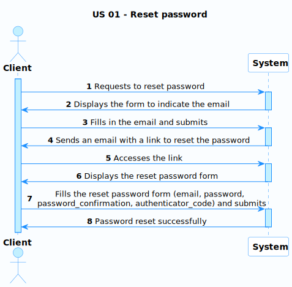
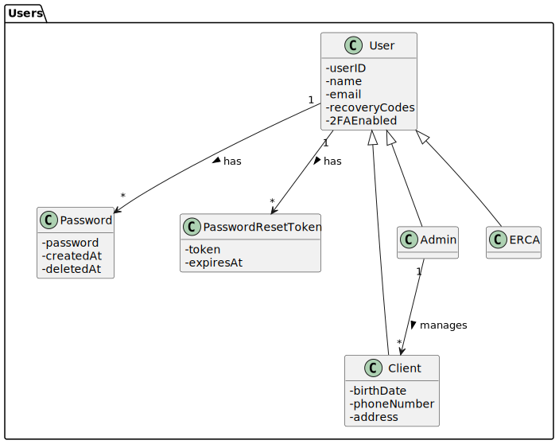
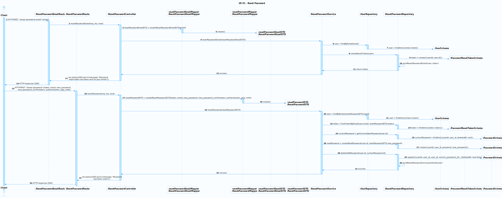

# US 01 - As a client, I want to reset my password if I forget it.

### User Story Description

As a client, I want to reset my password if I forget it so that I can regain access to my account and continue using the
online shop services.

### Acceptance Criteria

* **AC1:** The user should be able to access the reset password functionality from the login page.
* **AC2:** The system should verify the user's identity by sending an email to their registered email address.
* **AC3:** The email should contain a unique, time-limited password reset link or token.
* **AC4:** The user should be able to enter and confirm a new password as well the required two-factor authentication 
code (provided by an authenticator app) after clicking on the password reset link.
* **AC5:** The system should enforce password complexity rules (e.g., minimum length, mix of uppercase and lowercase 
letters, numbers, and special characters).
* **AC6:** The system should ensure that the new password is different from the previous passwords.
* **AC7:** The system should save the new password securely (hashed) and notify the user of a successful password reset.
* **AC8:** The system should not allow the generation of a new password reset link if there was 3 unexpired links for 
the same user.

### Found out Dependencies

- The user must have a registered account with a valid email address.
- The system must use an email service to send the password reset link.
- The system must have a two-factor authentication mechanism implemented.
- The system must have password complexity rules defined.
- The system must have a secure password storage mechanism.
- The user cant be logged in to reset the password.

### Security Constraints

- The password reset link should be unique.
- As a security measure, the password reset link should expire after a certain period.
- As a user I can't reset the password of another user.

### Input and Output Data

**Input Data:**

- User's registered email address.
- New password.
- Confirmation of the new password.
- Two-factor authentication code.

**Output Data:**

- Password reset email with a unique link or token.
- Success or error message after the password reset attempt.
- Email notification of successful password reset.

### Entry and Exit Points and Assets

**Entry Points:**

- Login page (password reset request).
- Password reset page (accessed via the email link).

**Exit Points:**

- Successful password reset notification.
- Error message (invalid or expired token, unsuccessful password reset).

**Assets**

| ID  | Name                 | Description                                                | Trust Level |
|-----|----------------------|------------------------------------------------------------|-------------|
| 1   | User email address   | The user email                                             | 2           |
| 2   | User password        | The user password                                          | 3           |
| 3   | Password reset token | The unique token used for a temporary reset password link  | 5           |
| 4   | 2FA code             | The authentication code provided by the authentication app | 5           |

### System Sequence Diagram (SSD)

In the following SSD, the Client interacts with the system to request a password reset. 
The system responds by sending an email with a unique password reset link. 
The client then interacts with the system to reset the password, providing the new password and two-factor 
authentication code.

### Relevant Domain Model Excerpt

In this excerpt, we focus only on the `Users` package. Both `Client`, `Admin`, and `ERCA` classes are included
extends from the `User` class. The `User` contains the email used to send the password reset link as well the attributes
necessary to the 2FA (`recoverCodes` and `2FAEnabled)`. Additionally, the `User` class has a relationship with the 
`PasswordResetToken` class, which is used to store the token generated for the password reset process and the expiration
date of the token. Finally, the `User` class has a relationship with the `Password` class, which is used to store the
hashed passwords, this helps to ensure that the new password is different from the previous ones.

## Sequence Diagram (SD) FrontEnd

The sequence diagram below illustrate the interaction between the `Client`, `LoginPage`, `ResetPasswordPage`, 
`ResetPasswordService` and the `Backend` components to describe the password reset process.

This process can be divided into two main steps: 

1. The password reset email request 
2. The password reset 

For the first step, the `Client` interacts with the `LoginPage` to indicates that want to reset the password.
The `LoginPage` displays a form to the `Client` to enter the email address. The `Client` then fills the form and 
submits it. 
The `ResetPasswordService` receives the formData and sends an HTTP POST request to the `Backend` to request the password
reset email. In the case of success a confirmation message is displayed to the `Client`.

For the second step, the `Client` starts by clicking on the password reset link received in the email, being redirected 
to the `ResetPasswordPage`. This page displays a form to the `Client` to enter the new password, the confirmation of the
new password and the 2FA code. The `Client` fills the form and submits it. The `ResetPasswordService` receives the 
formData and sends an HTTP POST request to the `Backend` to reset the password. In the case of success a confirmation 
message is displayed to the `Client`.

## Sequence Diagram (SD) BackEnd

The following sequence diagram illustrates the interactions between the `Client` and all the backend components to
describe the password reset process.

Like the front-end sequence diagram, this process can be divided into two main steps:

1. The password reset email request
2. The password reset

For the first step the `Client` sends an HTTP POST request to the `ResetPasswordEmailRoute` with the email address. The
router then calls the `sendResetPasswordEmail()` function of the `ResetPasswordEmailController`, which validates the
request and creates a `resetPasswordEmailDTO` object using the `resetPasswordEmailMapper` class. The controller then
calls the `resetPasswordEmail()` function of the `ResetPasswordService`, which first checks if the user exists and then 
generates a `PasswordResetToken` object by calling the `createResetToken()` function of the `ResetPasswordRepository`.
When the token is created, the repository itself sends an email to the user with the token. The service then returns a
confirmation message to the controller, which sends a response to the client by the router.

For the second step, the `Client` sends an HTTP POST request to the `ResetPasswordRoute` with the new password, the
confirmation of the new password, the 2FA code, the token and the email. 
The router then calls the `resetPassword()` function of the `ResetPasswordController`, which validates the request and
creates a `resetPasswordDTO` object using the `resetPasswordMapper` class. The controller then calls the 
`resetPassword()` function of the `ResetPasswordService`. The service starts by checking if the email and token are 
valid. After that, the service gets the user `current_password` for later update the `deletedAt` attribute marking the
password as invalid, then the service creates a new `Password` object with the new password and saves it using the
`PasswordRepository`. Finally, the service updates the `current_password` to mark it as invalid using te same
`PasswordRepository`, At this moment the repository also sends an email to the user with the confirmation of the password
reset. The service then returns a confirmation message to the controller, which sends a response to the client by the
router.

> [!NOTE]
>
> The above sequence diagram is simplified to show the main interactions between the components.
> Some validations and error handling are omitted for clarity.
>
> For example: 
> - the system should validate the authenticationAppCode provided by the user at some point
> - should validate the password complexity rules
> - should validate if the token is expired
> - should validate if the user is logged in 
> - should validate if the user has 3 unexpired tokens
> - etc. ...

**Security Test Cases for US:**

1. **Email Enumeration**

- **Description:** Ensure that the system does not reveal whether an email address is registered or not.

- **Test Case:** Attempt to reset the password with a non-registered email address.

- **Expected Result:** The system should display a generic error message, such as "If this email address is registered,
a password reset link will be sent" without revealing whether the email address is registered or not.

2. **Rate Limiting**

- **Description:** Prevent brute-force attacks on the password reset endpoint.

- **Test Case:** Send multiple password reset requests in a short period (example: 50 request in a minute).

- **Expected Result:** The system should block further requests from the same IP address for a certain period 
(example: 10 minutes).

3. **Token Expiration**

- **Description:** Ensure that reset tokens have a limited validity period.

- **Test Case:** Attemp to use a token after expiration period (example: 1 hour).

- **Expected Result:** The system should display an error message indicating that the token has expired.

4. **Token Reuse**

- **Description:** Ensure that reset tokens can only be used once.

- **Test Case:** Attempt to use the same token for multiple password resets.

- **Expected Result:** The system should display an error message indicating that the token is invalid.

5. **Token binding to user**

- **Description:**: Ensure that reset tokens are bound to specific user accounts.

- **Test Case:** Attempt to use a token generated for one user account to reset the password of another account.

- **Expected Result:** The system should display an error message indicating that the token is invalid.

6. **Secure Communication**

- **Description:** Ensure that form data is transmitted securely over HTTPS.

- **Test Case:** Intercept requests and responses during the password reset process to check if any sensitive 
information (like the token) is transmitted over an insecure channel (HTTP instead of HTTPS).

- **Expected Result:** All sensitive communications should be encrypted using HTTPS.

7. **Token Storage Security**

- **Description:** Ensure that reset tokens are stored securely.

- **Test Case:** Attempt to access the database and retrieve reset tokens to check if they are stored in plain text.

- **Expected Result:** Tokens should be hashed or encrypted before storage, the token sent by email should be a hash of
the token stored in the database.

8. **Cross-Site Scripting (XSS)**

- **Description:** Ensure that the password reset process is protected against XSS attacks.

- **Test Case:** Attempt to inject malicious scripts into any part of the password reset process 
(e.g., through the email field).

- **Expected Result:** The system should sanitize all inputs to prevent script injection.

9. **Log Analysis**

- **Description:** Ensure that sensitive information is not logged.

- **Test Case:** Trigger various steps of the password reset process and review server logs.

- **Expected Result:** Sensitive information such as passwords and tokens should not be logged.

10. **User Notification**

- **Description:** Ensure that users are notified of successful password resets.

- **Test Case:** Successfully reset the password and check if the user receives a notification email.

- **Expected Result:** The user should receive an email confirming the password reset.

11. **Password repetition**

- **Description:** Ensure that the new password is different from the previous ones.

- **Test Case:** Attempt to reset the password with the same password as the current one or one of the last three.

- **Expected Result:** The system should display an error message indicating that the new password is invalid.

12. **Password Complexity**

- **Description:** Ensure that the new password meets complexity requirements.

- **Test Case:** Attempt to reset the password with a password that does not meet the complexity requirements.

- **Expected Result:** The system should display an error message indicating that the new password is invalid.