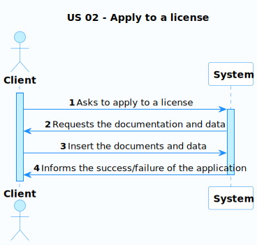
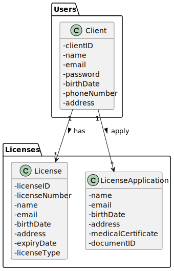
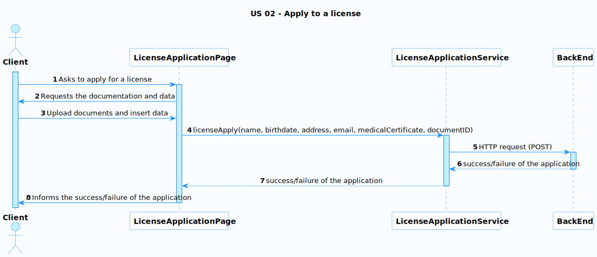
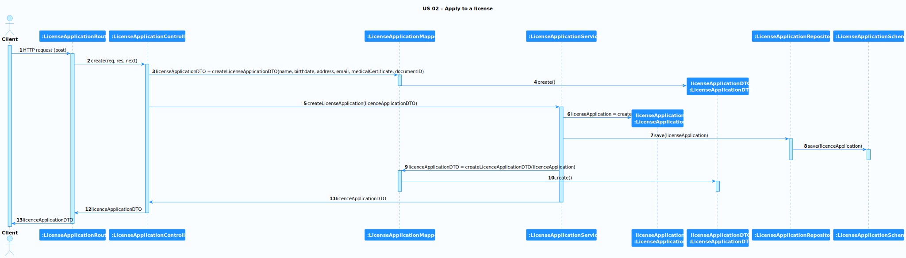

# US 02 - Apply to a license

### User Story Description

As a client, I want to upload necessary documents to verify my identity during the license application process.

### Acceptance Criteria

* **AC1:** The application form must be intuitive.
* **AC2:** The required documentation must be clearly specified.

### Found out Dependencies

* This US does not depend on any other.

### Input and Output Data

**Input Data:**

* Name
* Birthdate
* Address
* Email
* Medical certificate
* Document ID

**Output Data:**

* Success/failure of the request

### Entry and Exit Points and Assets

**Entry Points:**

* License Application Page

**Exit Points:**

* Notification of the success or failure of the operation

**Assets**

| ID |        Name        |                Description                 | Trust Level |
|----|:------------------:|:------------------------------------------:|:-----------:|
| 1  | Client Information |       The personal data of the user        | Client (3)  |
| 2  |     Documents      | The required documents for the application | Client (3)  |

### System Sequence Diagram (SSD)

### Relevant Domain Model Excerpt 

## Sequence Diagram (SD) FrontEnd

## Sequence Diagram (SD) BackEnd

**Security Test Cases for US 02 (Apply to a license):**

1. **Authentication and Authorization:**
    - Ensure that the client can only request a license for themselves.
1. **Input Validation and Sanitization:**
    - Thoroughly test all input fields with various types of input, including invalid data, special characters, SQL injection attempts, and XSS payloads.
    - Verify that input is properly sanitized before being stored in the database or displayed on the website.
1. **File Upload Security:**
    - If allowing documents uploads, test for vulnerabilities related to file type restrictions, file size limits, and potential malicious file uploads.
    - Ensure that uploaded documents are stored securely and cannot be used to execute arbitrary code on the server.
1. **Data Integrity:**
    - Test that the saved application data matches the input provided by the client.
    - Verify that the system prevents duplicate applications entries with the same client.
1. **Error Handling:**
    - Induce errors during the license application process (e.g., by submitting incomplete forms or invalid data) and ensure that error messages are informative but do not reveal sensitive system details.
1. **Logging and Auditing:**
    - Confirm that the system logs all actions related to license process, including the client information, timestamp, and relevant message. This can be helpful for tracking and auditing purposes.

