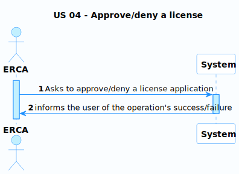
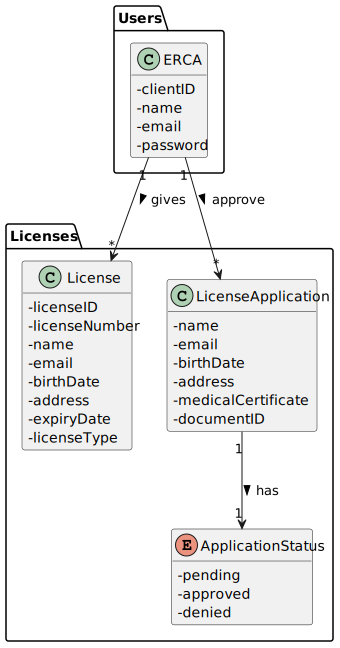
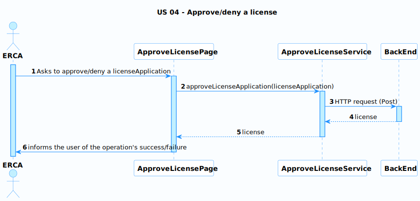
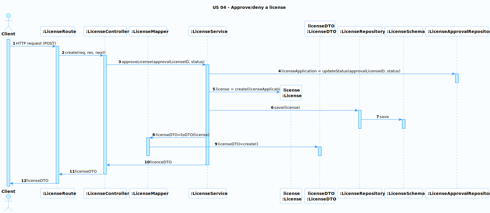

# US 04 - Approve/deny a license

### User Story Description

As ERCA, I want to approve/deny a users license application.

### Acceptance Criteria

* **AC1:** The applications must be ordered by date

### Found out Dependencies

* There is a dependency to US02 because to view the applications the clients must already have applied for a license.

### Input and Output Data

**Input Data:**

* Approval/Denial of the application

**Output Data:**

* Details of the application

### Entry and Exit Points and Assets

**Entry Points:**

* License Applications Page

**Exit Points:**

* Details of the application

**Assets**

| ID |          Name          |                   Description                    |     Trust Level     |
|----|:----------------------:|:------------------------------------------------:|:-------------------:|
| 1  |  Client's information  |        Relevant information of the client        |      ERCA (2)       |
| 2  | Client's documentation | Necessary documents for the application analysis |      ERCA (2)       |

### System Sequence Diagram (SSD)

### Relevant Domain Model Excerpt 

## Sequence Diagram (SD) FrontEnd

## Sequence Diagram (SD) BackEnd

**Security Test Cases for US 04 (Approve/deny a license):**

1. **Authentication and Authorization:**
    - Ensure that only ERCA can approve/deny a license application.
1. **Input Validation and Sanitization:**
    - Thoroughly test all input fields with various types of input, including invalid data, special characters, SQL injection attempts, and XSS payloads.
    - Verify that input is properly sanitized before being stored in the database or displayed on the website.
1. **File Download Security:**
    - Verify that the files are downloaded securely and are not altered or corrupted.
    - Ensure that the download process does not expose the system to vulnerabilities such as path traversal or exposure of sensitive information.
1. **Data Integrity:**
    - Check if the status is updated.
1. **Error Handling:**
    - Induce errors during the approval/deny process (e.g., error communicating with the backend.) and ensure that error messages are informative but do not reveal sensitive system details.
1. **Logging and Auditing:**
    - Confirm that the system logs all actions related to license process, including the ERCA information, timestamp, and relevant message. This can be helpful for tracking and auditing purposes.

