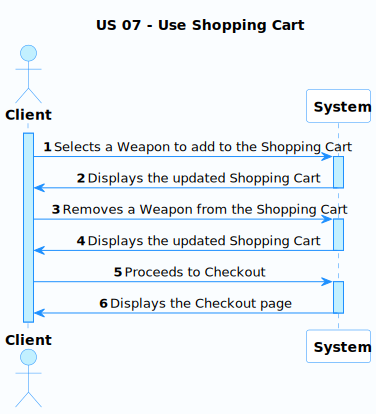
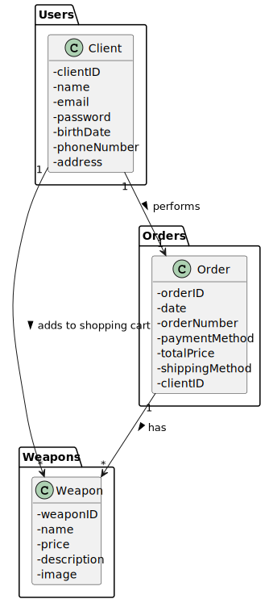
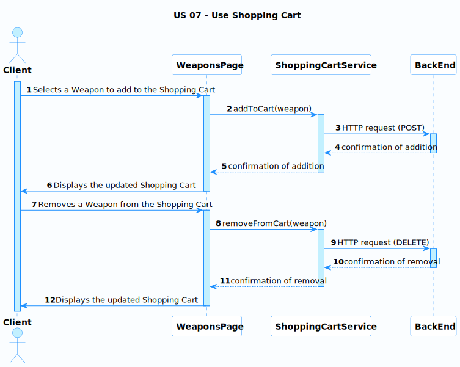
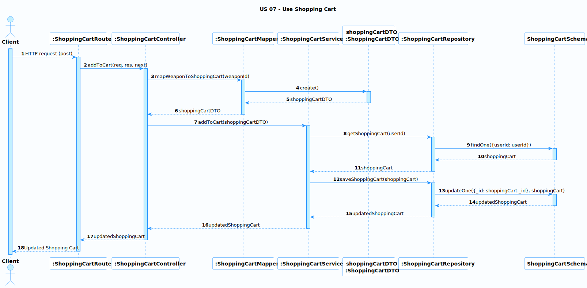

# US 07 - Use Shopping Cart

### User Story Description

As a client, I want to add items to my shopping cart so that I can keep track of the items I want to purchase before completing my order.

### Acceptance Criteria

* **AC1:** When I click on the "Add to Cart" button on a weapon item, the item should be added to my shopping cart.
* **AC2:** I should be able to view all items in my shopping cart on the shopping cart page.
* **AC3:** I should be able to remove items from my shopping cart if I change my mind.
* **AC4:** The total price of all items in my shopping cart should be displayed on the shopping cart page.

### Found out Dependencies

- The user must be logged in to add items to their shopping cart.
- The shopping cart functionality depends on the weapons catalog being populated with items.

### Input and Output Data

**Input Data:**

- The ID of the weapon item to be added to the shopping cart.

**Output Data:**

- The updated shopping cart with the new item added.

### Entry and Exit Points and Assets

**Entry Points:**

- The "Add to Cart" button on the weapons catalog page.
- The shopping cart page.

**Exit Points:**

- The shopping cart page after an item has been added.
- The weapons catalog page after an item has been added to the cart.

**Assets**

| ID   | Name          | Description                      | Trust Level |
| ---- | ------------- | -------------------------------- | ----------- |
| 1    | Weapons       | The catalog of weapons for sale  | High        |
| 2    | Shopping Cart | The user's current shopping cart | Medium      |

### System Sequence Diagram (SSD)

In this SSD, the Client interacts with the System to add and remove Weapons from the Shopping Cart, and to proceed to Checkout. The System responds by updating the Shopping Cart and displaying the appropriate pages to the Client.

### Relevant Domain Model Excerpt 

In this excerpt, we focus on the `Client`, `Weapon`, and `Order` classes, as they are the most relevant for the "Use Shopping Cart" user story. The `Client` class has a relationship with the `Weapon` class (adds to shopping cart) and the `Order` class (performs). The `Order` class also has a relationship with the `Weapon` class (has).

## Sequence Diagram (SD) FrontEnd

The Sequence Diagram (SD) for the front-end of US 07 (Use Shopping Cart) illustrates the interactions between the **Client**, **WeaponsPage**, **ShoppingCartService**, and the **BackEnd**. The diagram starts with the Client selecting a weapon to add to the Shopping Cart on the WeaponsPage. The WeaponsPage then calls the addToCart() function of the ShoppingCartService, which sends an HTTP POST request to the BackEnd. After the BackEnd confirms the addition, the ShoppingCartService informs the WeaponsPage, which then displays the updated Shopping Cart to the Client.

The diagram also shows the process for removing a weapon from the Shopping Cart. The Client selects a weapon to remove on the WeaponsPage, which then calls the removeFromCart() function of the ShoppingCartService. The ShoppingCartService sends an HTTP DELETE request to the BackEnd, which confirms the removal. The ShoppingCartService then informs the WeaponsPage, which displays the updated Shopping Cart to the Client. The diagram effectively demonstrates the flow of information and interactions between the front-end components and the BackEnd for adding and removing weapons from the Shopping Cart.

## Sequence Diagram (SD) BackEnd

The Sequence Diagram (SD) for the backend of US 07 (Use Shopping Cart) demonstrates the interactions between the **Client**, **ShoppingCartRoute**, **ShoppingCartController**, **ShoppingCartService**, **ShoppingCartMapper**, **ShoppingCartDTO**, **ShoppingCartRepository**, and **ShoppingCartSchema**. The diagram starts with the Client sending an HTTP POST request to the ShoppingCartRoute. The ShoppingCartRoute then calls the addToCart() function of the ShoppingCartController, which in turn calls the addToCart() function of the ShoppingCartService.

The ShoppingCartService retrieves the shopping cart for the user by calling the getShoppingCart() function of the ShoppingCartRepository, which interacts with the ShoppingCartSchema to find the shopping cart for the given user ID. The ShoppingCartService then calls the mapWeaponToShoppingCart() function of the ShoppingCartMapper, which creates a new ShoppingCartDTO object. The ShoppingCartService then calls the saveShoppingCart() function of the ShoppingCartRepository, which interacts with the ShoppingCartSchema to update the shopping cart.

The updated shopping cart is then passed back through the ShoppingCartService, ShoppingCartController, and ShoppingCartRoute, and is finally returned to the Client as an updated Shopping Cart. The diagram effectively illustrates the flow of information and interactions between the backend components for adding a weapon to the shopping cart.

**Security Test Cases for US 07 (Use Shopping Cart)**

The goal of these tests is to ensure the shopping cart feature is resilient to common security vulnerabilities and protects user data.

**1. Authentication and Authorization:**

- **Test Case:** Verify that a user cannot add or remove items from the shopping cart without being logged in.
- **Expected Result:**  Attempting to modify the cart without authentication should result in an error message or redirect to the login page.
- **Tools/Methods:** Manual testing, interception of HTTP requests (e.g., using browser developer tools or a proxy like Burp Suite).

**2. Input Validation and Sanitization:**

- **Test Case:**  Try adding items to the cart with invalid input (e.g., negative quantities, special characters, SQL injection attempts).
- **Expected Result:**  The system should reject invalid input with clear error messages.  Input should be sanitized before it's used in queries or displayed on the page.
- **Tools/Methods:** Manual testing, automated fuzzing tools, static code analysis tools.

**3. Cross-Site Scripting (XSS) Prevention:**

- **Test Case:**  Attempt to inject malicious JavaScript code into the cart (e.g., via item names, descriptions, or quantities).
- **Expected Result:**  The injected code should be rendered harmless, either by escaping it or removing it entirely.
- **Tools/Methods:** Manual testing, automated XSS scanners (e.g., OWASP ZAP).

**4. Cross-Site Request Forgery (CSRF) Prevention:**

- **Test Case:** Simulate a CSRF attack by sending a forged request to add or remove an item from the cart.
- **Expected Result:**  The system should reject the forged request due to the presence of CSRF tokens or other protection mechanisms.
- **Tools/Methods:** Manual testing with modified HTTP requests, CSRF testing tools.

**5. Sensitive Data Protection:**

- **Test Case:** Ensure that sensitive user data (e.g., credit card information) is not stored in the shopping cart itself.
- **Expected Result:** The cart should only store essential details like item IDs, quantities, and possibly temporary session IDs.
- **Tools/Methods:** Code review, database inspection.

**6. Session Management:**

- **Test Case:** Verify that the user's session is handled securely and that session hijacking is not possible.
- **Expected Result:** Sessions should have a limited lifetime, be invalidated on logout, and use secure cookie attributes.
- **Tools/Methods:** Manual testing with multiple browsers, session management testing tools.

**7. Error Handling:**

- **Test Case:**  Induce errors in the shopping cart process (e.g., by manipulating item availability).
- **Expected Result:** Error messages should not reveal sensitive implementation details.
- **Tools/Methods:** Manual testing, log analysis.

**Additional Security Considerations:**

- Consider using a Web Application Firewall (WAF) to provide an additional layer of protection against common web attacks.
- Regularly update the system's software and dependencies to mitigate known vulnerabilities.
- Perform security audits and penetration testing to proactively identify and fix potential issues.
