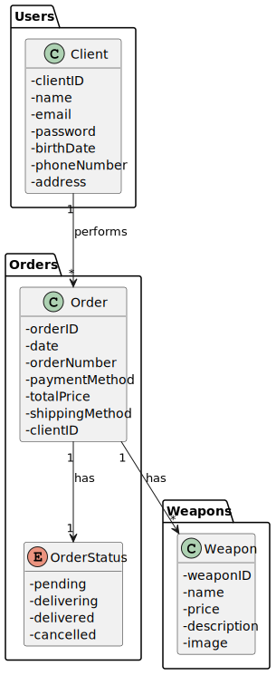
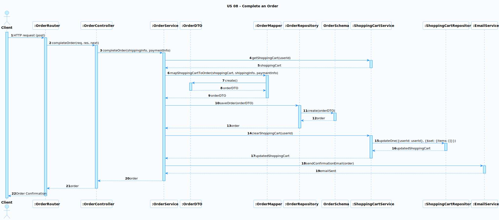

# US 08 - Complete an Order

### User Story Description

As a client, I want to complete an order.

### Acceptance Criteria

* **AC1:** As a client, I want to be able to review my shopping cart and confirm my order.
* **AC2:** As a client, I want to be able to provide my shipping information and select a payment method.
* **AC3:** As a client, I want to receive a confirmation of my order with the order details.
* **AC4:** As a client, I want my order to be saved and processed by the system.

### Found out Dependencies

- US07 - Use Shopping Cart

### Input and Output Data

**Input Data:**

- Shipping information (name, address, city, state, zip code, country)
- Payment method (credit card, PayPal, etc.)

**Output Data:**

- Order confirmation with order details (order number, order date, order total, shipping information, payment method, etc.)

### Entry and Exit Points and Assets

**Entry Points:**

- Shopping Cart page
- Checkout page

**Exit Points:**

- Order Confirmation page

**Assets**

| ID   | Name                    | Description                                                  | Trust Level |
| ---- | ----------------------- | ------------------------------------------------------------ | ----------- |
| 1    | Shopping Cart           | The list of items selected by the client for purchase        | Medium      |
| 2    | Checkout Page           | The page where the client enters their shipping information and selects a payment method | High        |
| 3    | Order Confirmation Page | The page displayed to the client after the order has been successfully submitted | Low         |
| 4    | Order                   | The details of the client's order, including the items purchased, shipping information, and payment method | High        |

### System Sequence Diagram (SSD)

**The System Sequence Diagram (SSD) for US 08 - Complete an Order** describes the interactions between the `Client` and the `System` to complete an order. The SSD starts with the `Client` entering their shipping and payment information, which is then validated by the `System`. After validation, the `Client` confirms the order, and the `System` sends a confirmation email to the `Client`. The SSD illustrates the flow of events and interactions between the `Client` and the `System` to complete an order, highlighting the entry and exit points, assets, and the sequence of messages exchanged between the actors. The SSD serves as a useful tool to understand the system's behavior and requirements, aiding in the development and testing of the system.

### Relevant Domain Model Excerpt 

This excerpt includes the `Client`, `Order`, and `Weapon` classes, as well as the OrderStatus enum, which are all relevant for completing an order. The relationships between these classes are also shown, including the Client performing an Order, an Order containing one or more Weapons, and an Order having an `OrderStatus`.

## Sequence Diagram (SD) FrontEnd

**The Sequence Diagram (SD) for US 08 - Complete an Order** describes the interactions between the `Client`, `CheckoutPage`, `OrderService`, and `BackEnd` to complete an order. The SD starts with the `Client` entering their shipping and payment information on the `CheckoutPage`. The `CheckoutPage` then sends this information to the `OrderService` to create an order. The `OrderService` sends an HTTP POST request to the `BackEnd` to process the order and receives an order confirmation in response. The `OrderService` then sends the order confirmation to the `CheckoutPage`, which displays it to the `Client`. The SD illustrates the flow of events and interactions between the front-end and back-end components to complete an order, highlighting the sequence of messages exchanged between the actors. The SD serves as a useful tool to understand the system's behavior and requirements, aiding in the development and testing of the system.

## Sequence Diagram (SD) BackEnd

**The Sequence Diagram (SD) for the Backend of US 08 - Complete an Order** describes the interactions between the `OrderRouter`, `OrderController`, `OrderService`, `OrderModel`, `OrderRepository`, `ShoppingCartService`, `ShoppingCartRepository`, and `EmailService` to complete an order. The SD starts with the `Client` sending an HTTP POST request to the `OrderRouter`, which invokes the `completeOrder` method in the `OrderController`. The `OrderController` then calls the `completeOrder` method in the `OrderService`, passing in the shipping and payment information.

The `OrderService` retrieves the shopping cart for the user from the `ShoppingCartService` and maps it to an order using the `OrderModel`. The `OrderService` then saves the order to the database using the `OrderRepository` and clears the shopping cart using the `ShoppingCartService`. Finally, the `OrderService` sends a confirmation email to the user using the `EmailService`.

**Security Test Cases for US 08 (Complete an Order):**

1. **Payment Security:**
   - Ensure that sensitive payment data (e.g., credit card numbers) are transmitted securely (e.g., using HTTPS and encryption).
   - Test for vulnerabilities in the payment processing flow, such as SQL injection and cross-site scripting (XSS).
1. **Input Validation:**
   - Verify that all input fields on the checkout page are validated for correct format and type.
   - Test for injection attacks (e.g., SQL injection, command injection) by entering malicious code in input fields.
1. **Order Integrity:**
   - Ensure that the order details (items, quantities, prices) cannot be tampered with during the checkout process.
   - Validate that the final order total is calculated correctly and matches the prices shown in the cart.
1. **Inventory Management:**
   - If applicable, test that the system correctly updates inventory levels after an order is placed to prevent overselling.
1. **Order Confirmation:**
   - Verify that the order confirmation email is sent to the correct email address and includes accurate order details.
   - Test for any vulnerabilities in the email sending process that could be exploited for spam or phishing attacks.
