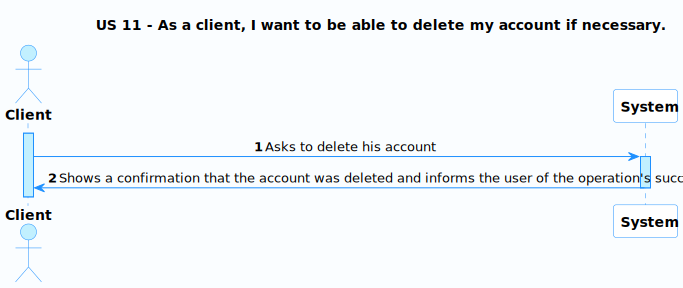
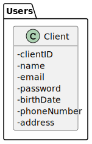
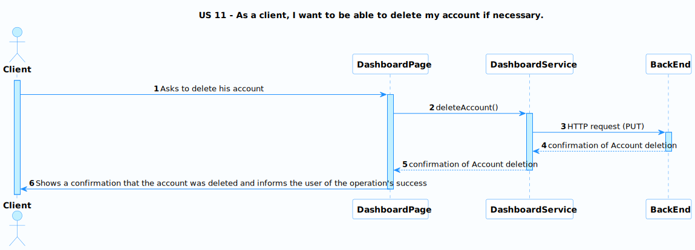
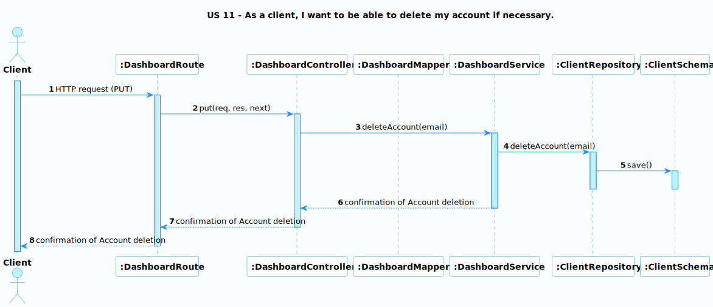

# US 11 - Delete my account

### User Story Description

As a client, I want to be able to delete my account if necessary.

### Acceptance Criteria

* **AC1:** The user needs to verify their identity before being allowed to delete their account.
* **AC2:** The account won't be deleted from the database, instead, all the data will be removed except a unique identifier like the email.

### Found out Dependencies

* This US does not depend on any other.

### Input and Output Data

**Input Data:**

* N/A

**Output Data:**

* Confirmation of Account Deletion

### Entry and Exit Points and Assets

**Entry Points:**

* Dashboard page

**Exit Points:**

* Notification of the success or failure of the operation

**Assets**

| ID |        Name        |        Description        | Trust Level |
|----|:------------------:|:-------------------------:|:-----------:|
| 1  | Client Information | The user's personal data  | Client (3)  |

### System Sequence Diagram (SSD)

### Relevant Domain Model Excerpt 

## Sequence Diagram (SD) FrontEnd

## Sequence Diagram (SD) BackEnd

## Security Test Cases

**1. Authentication and Authorization**
- Ensure only authenticated and authorized clients can delete their account.

**2. Data Integrity**
- Verify that the account deletion process removes all user data except for a unique identifier.

**3. Error Handling**
- Error messages should be informative yet generic, without revealing any system details or sensitive information.

**4. Logging and Auditing**
- Confirm that the system logs all actions related to account deletion.

