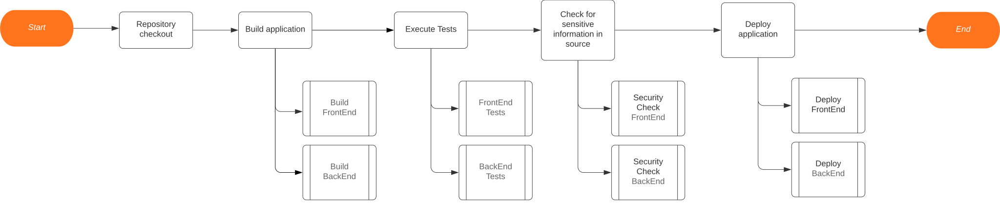

# Project Specification: LockNLoad System

## Overview

This project aims to develop a secure online platform for the purchase and sale of weapons. The system will facilitate interactions between three main roles: Admin, Client, and ERCA (Entity Regulating Gun Purchases). The system will manage aggregates such as Users, Weapons, and Orders to ensure secure transactions and regulatory compliance.

## Roles

### Admin

- Responsible for managing the overall operation of the system.
- Can add new weapons to the catalog, view statistics, and send messages to users.
- Ensures regulatory compliance and oversees the approval process for license applications.

### Client

- Represents users who wish to purchase weapons.
- Can apply for a license, browse the catalog, make purchases, and manage their account.

### ERCA (Entity Regulating Gun Purchases)

- An external entity responsible for approving license applications.
- Reviews and approves/rejects license applications submitted by clients.

## Aggregates

### Users

- Contains information about registered users, including clients and administrators.
- Stores authentication credentials, profile details, and account preferences.

### Weapons

- Represents the catalog of available weapons for sale.
- Includes details such as name, description, price, and availability.

### Orders

- Tracks the history of all purchases made by clients.
- Contains information about purchased items, transaction details, and delivery status.

## User Stories

1. **Authentication:**
   - US01: As a client, I want to reset my password if I forget it.
1. **License Application:**
   - US02: As a client, I want to upload necessary documents to verify my identity during the license application process.
   - US03: As a client, I want to see the status of my license application.
1. **License Approval by ERCA:**
   - US04: As ERCA, I want to approve/deny a users license application.
1. **Access to Weapons Catalog and Purchase Limit:**
   - US05: As a client, I want to filter the weapons catalog based on different criteria such as type, price, and availability.
   - US06: As a client, I want to see the weapons catalog
1. **Purchase Process:**
   - US07: As a client, I want to add items to my shopping cart.
   - US08: As a client, I want to complete an order.
1. **Purchase History:**
   - US09: As a client, I want to view a history of all my previous purchases.
1. **Account Management:**
   - US10: As a client, I want to edit my profile information such as delivery address and contact details.
   - US11: As a client, I want to be able to delete my account if necessary.
1. **Add New Weapon for Sale:**
   - US12: As an administrator, I want to have the ability to add a new weapon to the catalog of weapons available for sale.

## Non-functional Requirements

### Security
- The system must ensure the security of user data, including personally identifiable information, identification documents, and transaction history.
- The system must have user authorization and authentication.
- Encryption mechanisms must be implemented.
- Two-factor authentication should be used to enhance user account security.
- The system should not use any default passwords for all the application framework or any components used by the application.

### Regulatory Compliance
- The system must comply with all relevant laws and regulations related to the sale of firearms, including background checks, age restrictions, and licensing requirements.
- There should be clear procedures to ensure that only eligible individuals can access and purchase firearms through the platform, with identity verification and appropriate document checks during the licensing application process.
### Usability
- The user interface must be intuitive and easy to use, ensuring a pleasant experience for all types of users.
- The system must be accessible across different browsers, offering a consistent experience.

## Pipeline Design

To design an effective pipeline for our application, we followed a simple yet adaptable approach, so we can change it as the project goes on.

## Technologies Used

### Frontend

The frontend of the system will be developed using **Angular**, a popular and robust JavaScript framework for building dynamic web applications. Angular provides a structured and modular approach to frontend development, allowing for the creation of interactive user interfaces with ease. Its extensive ecosystem of libraries and tools makes it an excellent choice for implementing complex features and ensuring a smooth user experience.

### Backend

The backend of the system will be powered by **Node.js**, a powerful JavaScript runtime environment known for its scalability and performance. Node.js enables the development of fast and efficient server-side applications, making it ideal for building the backend logic of our arms trading system. With its event-driven, non-blocking I/O model, Node.js is well-suited for handling asynchronous operations and managing concurrent requests.

### Database

**MongoDB** will be used as the database management system for storing and managing the system's data. MongoDB is a document-oriented NoSQL database that offers flexibility, scalability, and high performance. Its schema-less design allows for the storage of complex data structures, making it suitable for handling diverse data types such as user profiles, weapon details, and purchase history. MongoDB's distributed architecture also ensures reliability and fault tolerance, crucial for the robust operation of our arms trading system.

## Assignment of tasks

### Team Members

The teams consists of students identified in the following table.

| Student Number	| Name |
|--------------|----------------------------|
| **1201000**  | Bruno Ribeiro          |
| **1201001**  | Carlos Rodrigues          |
| **1201007**  | José Pessoa          |
| **1201115**  | Miguel Almeida        |
| **1220273**  | Pedro Vilela         |

### Task Distribution 

Throughout the project's development period, the distribution of _tasks / requirements / features_ by the team members was carried out as described in the following table.

| Task                   | Phase 1 | Phase 2: Sprint 1 | Phase 2: Sprint 2 |
|------------------------|:-------:|:-----------------:|:-----------------:|
| Use Case Diagram (UCD) |   all   |        all        |        all        |
| Domain Model           |   all   |        all        |        all        |
| US 01                  | 1220273 |                   |                   |
| US 02                  | 1201000 |                   |                   |
| US 03                  | 1201000 |                   |                   |
| US 04                  | 1201000 |                   |                   |
| US 05                  | 1201001 |                   |                   |
| US 06                  | 1201001 |                   |                   |
| US 07                  | 1201115 |                   |                   |
| US 08                  | 1201115 |                   |                   |
| US 09                  | 1201007 |                   |                   |
| US 10                  | 1201007 |                   |                   |
| US 11                  | 1201007 |                   |                   |
| US 12                  | 1201115 |                   |                   |

## Conclusion

This markdown specification outlines the roles, aggregates, and user stories for the development of a secure arms trading system. By fulfilling these requirements, the system will provide a reliable and user-friendly platform for the purchase and sale of weapons while ensuring regulatory compliance and security.